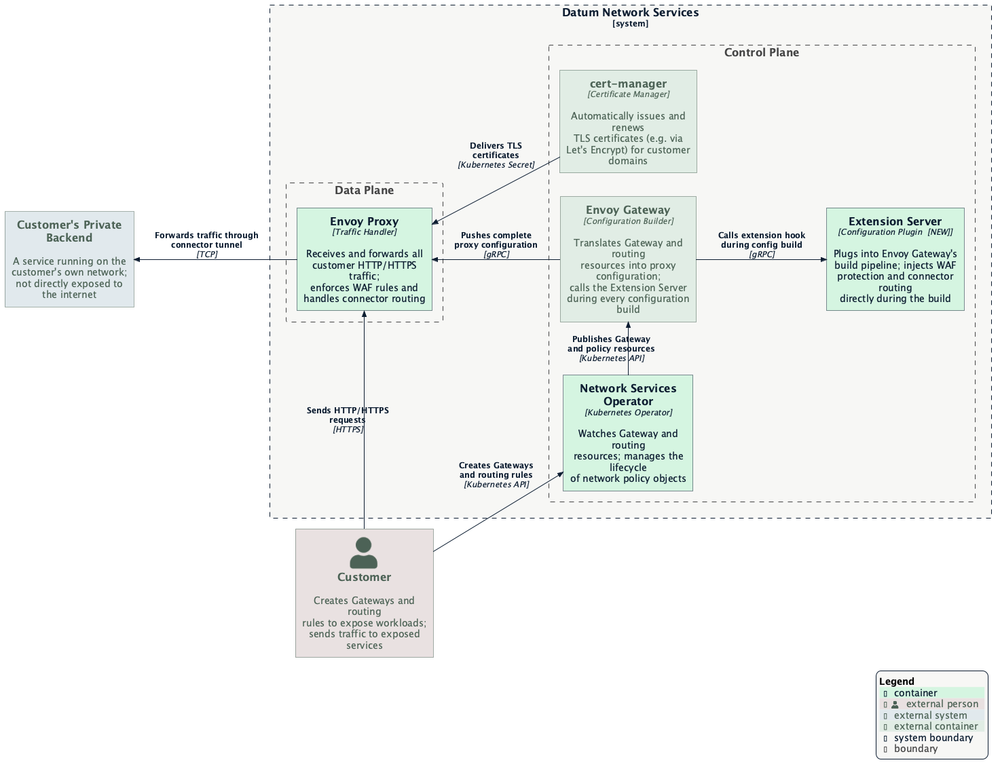
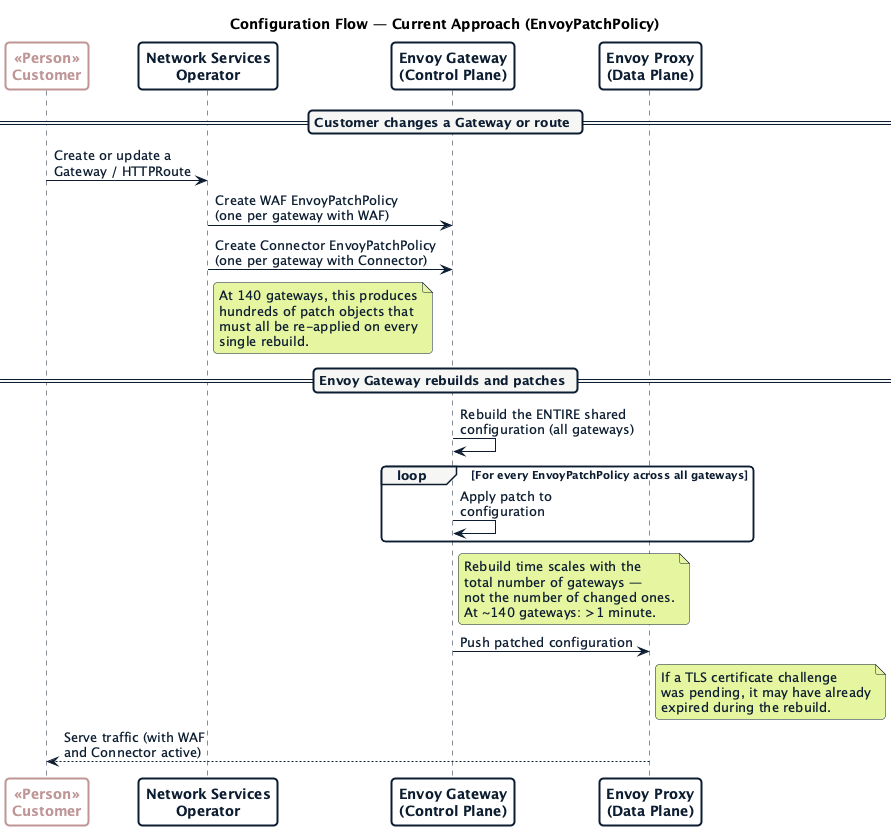
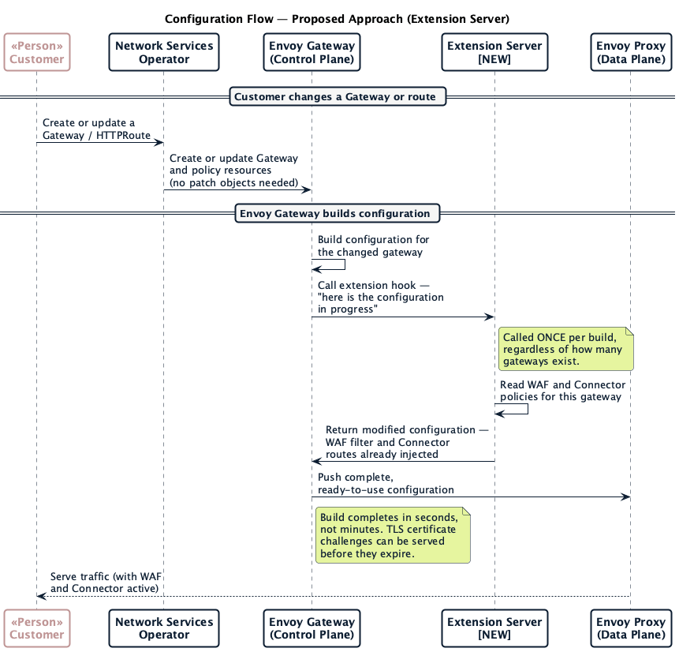

# Envoy Gateway Extension Server

- [Summary](#summary)
- [Motivation](#motivation)
  - [Background: How Datum's network services work today](#background-how-datums-network-services-work-today)
  - [The current approach: EnvoyPatchPolicy](#the-current-approach-envoypatchpolicy)
  - [The scaling problem](#the-scaling-problem)
  - [Goals](#goals)
  - [Non-Goals](#non-goals)
- [Proposal](#proposal)
  - [User Stories](#user-stories)
  - [Risks and Mitigations](#risks-and-mitigations)
- [Design Details](#design-details)
  - [System Architecture](#system-architecture)
  - [Configuration Flow: Current vs. Proposed](#configuration-flow-current-vs-proposed)
  - [Extension Server Responsibilities](#extension-server-responsibilities)
  - [Extension Mechanism: Which Hook and Why](#extension-mechanism-which-hook-and-why)
  - [The gRPC Contract](#the-grpc-contract)
  - [Registering the Extension Server with Envoy Gateway](#registering-the-extension-server-with-envoy-gateway)
  - [Securing the Extension Server](#securing-the-extension-server)
  - [Sourcing Policy: How the Extension Server Knows What to Inject](#sourcing-policy-how-the-extension-server-knows-what-to-inject)
  - [Deployment Topology](#deployment-topology)
  - [High Availability](#high-availability)
  - [Reference Implementation](#reference-implementation)
  - [Envoy Version Coupling](#envoy-version-coupling)
  - [Verifying the System End-to-End](#verifying-the-system-end-to-end)
  - [Transition Plan](#transition-plan)
- [Drawbacks](#drawbacks)
- [Alternatives](#alternatives)

## Summary

Datum's network services let customers expose their workloads through Gateways
configured via the [Kubernetes Gateway API](https://gateway-api.sigs.k8s.io/).
The network-services-operator (NSO) adds two capabilities on top of standard
Gateway API: **Traffic Protection** (a Web Application Firewall, or WAF) and the
**Connector** (which routes traffic to private backends through an outbound
tunnel). Both are implemented today by emitting
[**EnvoyPatchPolicy (EPP)**](https://gateway.envoyproxy.io/docs/tasks/extensibility/envoy-patch-policy/)
objects — one or more per gateway per feature — that patch the proxy
configuration after it is built.

Because all customer gateways share a single Envoy configuration, every change
triggers a full rebuild and re-applies every EPP patch across the entire fleet.
At ~140 gateways this exceeds one minute, which races
[Let's Encrypt's HTTP-01 challenge](https://letsencrypt.org/docs/challenge-types/#http-01-challenge)
for certificate issuance and causes TLS failures for customers. Preliminary
measurements at N=10 gateways show xds-ir build time ≈24× higher with EPPs
than without (≈72 ms vs ≈3 ms).

This enhancement replaces the per-gateway EPP objects with a single **extension
server** — a companion service that plugs into Envoy Gateway's build pipeline
via its
[supported extension hooks](https://gateway.envoyproxy.io/docs/tasks/extensibility/extension-server/)
and applies the same WAF and Connector adjustments inline, called once per build
rather than re-applied N times. This is the upstream-recommended pattern for
this kind of customization.

## Motivation

### Background: How Datum's network services work today

Datum's data plane is [**Envoy Proxy**](https://www.envoyproxy.io/), configured
at runtime by [**Envoy Gateway**](https://gateway.envoyproxy.io/), which
translates Kubernetes `Gateway` and `HTTPRoute` resources into the configuration
Envoy understands. A critical constraint is that Envoy Gateway
merges _all_ customer gateways into a **single, shared Envoy configuration**, so
any change to any gateway triggers a rebuild of the entire fleet's config. **NSO**
sits above Envoy Gateway, watching customer-created resources and managing the
additional Kubernetes objects that Envoy Gateway picks up.

### The current approach: EnvoyPatchPolicy

NSO adds two capabilities that Gateway API and Envoy Gateway don't support
natively:

- **Traffic Protection (WAF)** — injects a
  [Coraza](https://coraza.io/) Web Application Firewall filter and per-route
  policy configuration.
- **Connector** — routes traffic to a customer's private backend through an
  outbound tunnel, with an automatic "offline" fallback when the tunnel is down.

Both are implemented by emitting **EnvoyPatchPolicy (EPP)** objects. An EPP is
an after-the-fact instruction: once Envoy Gateway has built its configuration,
find a named internal component and inject an additional piece of configuration.
EPPs let NSO extend Envoy without forking Envoy Gateway, but their per-gateway,
after-the-fact nature creates the problems described below.

### The scaling problem

**1. Rebuild cost grows with gateway count, not change size.**
Envoy Gateway rebuilds the _entire_ shared configuration on every change, then
applies every EPP patch across all gateways — even if only one changed. At ~140
gateways this rebuild takes well over a minute.

**2. A slow rebuild races TLS certificate issuance.**
Let's Encrypt's HTTP-01 challenge requires Envoy to serve a short-lived token at
a specific URL within ~60 seconds. When a new Gateway is created,
[cert-manager](https://cert-manager.io/) triggers a challenge, but the full
rebuild and re-patching exceeds that window
at production scale — the challenge expires and the certificate fails. Customers
see unexpected TLS errors on new gateways.

**3. EPP patches couple to Envoy Gateway's internal naming — a fragility risk.**
EPPs identify targets by the names Envoy Gateway assigns internally to listeners
and route configurations. These names are gated behind runtime flags: in
production, EG runs with `runtimeFlags: [XDSNameSchemeV2]`, which selects the
naming scheme NSO's controllers target. NSO's EPPs are correct in production,
but correctness depends on that flag being present. Without it, EPPs fail with
only a `Programmed=False` condition — no data-plane error, no alert.

### Goals

- Replace all EPP objects emitted by NSO (WAF and Connector) with a single
  extension server registered with Envoy Gateway's extension hook mechanism.
- Reduce config change propagation time and eliminate the TLS certificate
  issuance race at production scale.
- Remove the implicit dependency on EG's flag-gated internal naming scheme.
- Adopt the upstream-recommended extension pattern, reducing long-term
  maintenance cost.

### Non-Goals

- **Replacing the Coraza WAF library.** Moving to a
  [WebAssembly WAF module](https://github.com/corazawaf/coraza-proxy-wasm) is a
  separate, independently motivated effort.
- **Eliminating the shared-configuration model.** This enhancement makes the
  build faster; all gateways still share one Envoy configuration.
- **Chaining multiple extension servers.** Envoy Gateway v1.8 can chain several
  extension servers via `extensionManagers`, each feeding the next. This
  enhancement deliberately introduces exactly one server that handles both WAF
  and Connector, because both mutations require a single cross-resource view of
  the build (see [Extension Mechanism](#extension-mechanism-which-hook-and-why));
  splitting them across chained servers is rejected, not unavailable.
- **Changing the customer-facing API.** Customers configure Traffic Protection
  and the Connector the same way; only the internal implementation changes.
- **Completing the performance characterization.** The performance sweep
  across N ∈ {10, 25, 50, 100, 200} is in progress; results will be
  incorporated when available.

## Proposal

Deploy a new **Extension Server** alongside NSO and Envoy Gateway and register
it as the EG extension hook endpoint. When Envoy Gateway builds configuration:

1. It calls the Extension Server via gRPC with the in-progress configuration.
2. The Extension Server reads WAF and Connector policy from Kubernetes and
   returns the configuration with those adjustments injected.
3. Envoy Gateway pushes the complete configuration to Envoy Proxy.

NSO stops emitting EPP objects; the same WAF and Connector logic moves into the
build pipeline.

### User Stories

#### WAF protection continues to work — and becomes more robust

A customer with Traffic Protection enabled sees no change in behavior — and it
becomes more robust: WAF enforcement no longer depends on Envoy Gateway's
flag-gated internal naming, so it can't silently fail if those conventions
shift.

#### New HTTPS Gateways get their TLS certificates on the first attempt

A customer creates a new HTTPS Gateway. Because the configuration build now
completes in seconds rather than minutes, Envoy serves the Let's Encrypt
challenge response within the timeout window and the certificate issues on the
first attempt.

#### Connector fallback routing continues to work

A customer routing traffic through the Connector continues to see the correct
"offline" fallback when the tunnel is down. Behavior is unchanged; only the
delivery mechanism changes.

### Risks and Mitigations

- **Critical-path availability.** An outage blocks all gateway config updates
  (in-flight traffic is unaffected — Envoy holds the last-known-good config).
  Mitigated by the HA posture — ≥2 replicas, health probes, retries, and
  fail-closed delivery (see [High Availability](#high-availability)). The
  residual tradeoff against per-gateway EPPs is stated in
  [Drawbacks](#drawbacks).
- **Build latency.** Every build now waits on the hook. Mitigated by serving
  policy from an in-memory cache — no synchronous reads on the build path — and
  monitoring per-build latency and error rate (see [Sourcing
  Policy](#sourcing-policy-how-the-extension-server-knows-what-to-inject) and
  [High Availability](#high-availability)).
- **EG hook-API coupling.** Mitigated by pinning the EG version and
  re-validating the hook contract on every upgrade (see [Envoy Version
  Coupling](#envoy-version-coupling)); the standing tradeoff is in
  [Drawbacks](#drawbacks).

## Design Details

### System Architecture

The diagram below shows the proposed end-state at the container level.



The Extension Server is a new control-plane service registered with Envoy
Gateway as the extension hook endpoint. All other components are unchanged in
role; NSO stops emitting EPP objects.

### Configuration Flow: Current vs. Proposed

#### Current flow (EnvoyPatchPolicy)



1. NSO creates EPP objects — one per feature per gateway (WAF, Connector).
2. Envoy Gateway rebuilds the full shared configuration and applies every EPP
   patch across all gateways.
3. The patched configuration is pushed to Envoy Proxy.

Build time scales with total gateway count, not change size — the core problem
at production scale.

#### Proposed flow (Extension Server)



1. NSO creates or updates Gateway and policy resources. No EPP objects.
2. Envoy Gateway builds the configuration and calls the Extension Server once
   via gRPC with the in-progress config.
3. The Extension Server injects WAF and Connector logic and returns the modified
   config.
4. Envoy Gateway pushes the complete configuration to Envoy Proxy.

Unlike the current flow, this work does not grow with the number of gateways.

### Extension Server Responsibilities

**Traffic Protection (WAF).** For gateways with Traffic Protection enabled,
inject the Coraza WAF filter and per-route policy. Policy is read from the same
Kubernetes resources NSO already manages.

**Connector.** For gateways with a Connector, inject routing rules for the
outbound tunnel and the automatic "offline" fallback. Connector target and
tunnel status are read from Kubernetes.

The Extension Server is stateless with respect to the build — every response is
computed from the snapshot Envoy Gateway passes in plus policy read from
Kubernetes (cached; see [Sourcing
Policy](#sourcing-policy-how-the-extension-server-knows-what-to-inject)).

### Extension Mechanism: Which Hook and Why

Envoy Gateway's
[extension framework](https://gateway.envoyproxy.io/contributions/design/extending-envoy-gateway/)
exposes a set of xDS-translation hooks that fire as EG turns its internal
representation into concrete Envoy resources. Each is a gRPC method EG calls
during the build, defined by the `EnvoyGatewayExtension` service in the
[`proto/extension` package](https://pkg.go.dev/github.com/envoyproxy/gateway/proto/extension).
The hooks differ in granularity:

| Hook | Fires | Receives | Suited to |
|------|-------|----------|-----------|
| `PostRouteModify` | per route built from an `extensionRef` filter | one `route.v3.Route` | route-scoped tweaks tied to a custom filter CRD |
| `PostVirtualHostModify` | per virtual host | one `route.v3.VirtualHost` | injecting routes/hosts |
| `PostHTTPListenerModify` | per HTTP listener | one `listener.v3.Listener` | listener-scoped filter changes |
| `PostClusterModify` | per cluster from a custom `backendRef` | one `cluster.v3.Cluster` | rewriting a backend's cluster |
| `PostEndpointsModify` | per cluster's EDS endpoints (added v1.8) | one `endpoint.v3.ClusterLoadAssignment` | rewriting per-endpoint addresses/metadata |
| `PostTranslateModify` | **once per build** | the **full** set of clusters, secrets, listeners, and route configurations | cross-cutting changes that span resource types |

**The Extension Server registers the single `PostTranslateModify` (a.k.a. the
`Translation`) hook.** This is the deliberate choice, for three reasons:

1. **It is the direct analog of what EPPs do today.** An EPP patches the
   finished xDS snapshot; `PostTranslateModify` hands the Extension Server that
   same finished snapshot in one call and lets it return the modified set. The
   mutation logic ports over almost mechanically.
2. **Both feature families need cross-resource visibility.** The Connector
   replaces backend *clusters* and then wires *routes* (CONNECT routes,
   tunnel-target domains) that reference them; WAF injects a *listener* filter
   and *per-route* config that must agree. The granular per-resource hooks never
   expose clusters and routes together in one call, so they cannot express the
   Connector's cluster-replace-then-route-wire sequence. `PostTranslateModify`
   sees everything at once.
3. **It is called once per build, not once per resource.** This is the property
   that fixes the scaling problem — the cost is paid a single time regardless of
   fleet size, instead of N times as with per-gateway EPP patches.

The response from `PostTranslateModify` **replaces Envoy Gateway's entire
resource set**, so the Extension Server must return *every* list — including the
ones it did not touch (secrets pass through unchanged). Dropping a list drops
those resources from the proxy.

The newer granular hooks change nothing here. `PostEndpointsModify` (v1.8) could
rewrite the Connector's tunnel endpoints at the EDS layer, but the Connector
already replaces whole clusters with static internal-upstream clusters that
carry their endpoint inline, so there is no separate EDS step to intercept.
Registering it would add a second hook — and a second per-resource call on every
build — for no capability the single `PostTranslateModify` does not already
provide. The design stays on one hook.

### The gRPC Contract

The Extension Server implements Envoy Gateway's published gRPC contract
directly; there is no higher-level SDK to adopt, and none is needed. The
upstream
[example extension server](https://github.com/envoyproxy/gateway/tree/main/examples/extension-server)
demonstrates the pattern.

- **Proto package:** `github.com/envoyproxy/gateway/proto/extension`, service
  `EnvoyGatewayExtension`.
- **Implementation pattern:** embed the upstream-provided
  `UnimplementedEnvoyGatewayExtensionServer` and implement only
  `PostTranslateModify`. The other hooks remain unimplemented — and, critically,
  are *not* enabled in the `extensionManager` config, so Envoy Gateway never
  calls them. Leaving them off keeps the contract surface (and the regression
  surface across EG upgrades) minimal.
- The Extension Server also serves a standard health endpoint for the Kubernetes
  liveness/readiness probes (see [Deployment
  Topology](#deployment-topology)); this is independent of the gRPC contract.

### Registering the Extension Server with Envoy Gateway

Envoy Gateway is told about the Extension Server through the
[`extensionManager`](https://gateway.envoyproxy.io/docs/api/extension_types/#extensionmanager)
block of the `EnvoyGateway` control-plane config (in production this is set via
the `envoy-gateway` HelmRelease values). The registration that NSO depends on:

```yaml
extensionManager:
  service:
    fqdn:
      hostname: <extension-server>.<namespace>.svc.cluster.local
      port: 5005
    tls:                              # see "Securing the Extension Server"
      certificateRef:                 # CA that signed the server cert (EG validates the server)
        name: extension-server-ca
      clientCertificateRef:           # client cert EG presents for mTLS (server authenticates EG)
        name: extension-server-client-cert
  hooks:
    xdsTranslator:
      post:
        - Translation                 # enables PostTranslateModify
      translation:
        listener: { includeAll: true }
        route:    { includeAll: true }
        cluster:  { includeAll: true }
        secret:   { includeAll: true }
  failOpen: false                      # see "High Availability"
```

Two registration details are easy to get wrong and were both confirmed against
a running Envoy Gateway cluster:

- **`translation.*.includeAll` must be `true` for listeners and routes.** The
  `Translation` hook sends clusters and secrets by default but **omits listeners
  and routes** unless `includeAll` is set. The WAF listener filter and all
  per-route mutations require them; without these flags the Extension Server
  runs but silently mutates nothing.
- **The hook enum is `HTTPListener`, not `Listener`.** Only relevant if the
  granular listener hook is ever enabled — the valid set in v1.8 is
  `VirtualHost | Route | HTTPListener | Cluster | Endpoints | Translation` — but
  the wrong value is rejected by the config validator.

Replacing EPPs also lets NSO **drop its dependency on the `XDSNameSchemeV2`
runtime flag.** Today NSO's EPP patches target xDS resources by EG's
flag-gated internal names (`http-80`, `tcp-443`, the per-listener HTTPS route
configs, `httproute/<ns>/<route>/rule/<idx>`); the Extension Server instead
iterates the resources EG hands it and matches on their structure and metadata,
so it is correct regardless of the naming scheme in effect. The
`enableEnvoyPatchPolicy` extension API is disabled once EPP emission stops;
`enableBackend` remains required (EG still resolves NSO's `Backend`/EndpointSlice
`backendRef`s into the clusters the Connector rewrites).

### Securing the Extension Server

The extension server runs in the **control-plane critical path with the power to
rewrite any proxy configuration Envoy Gateway produces.** Envoy Gateway's own
[extension server documentation](https://gateway.envoyproxy.io/docs/tasks/extensibility/extension-server/)
warns that a compromised extension server can inject arbitrary configuration and
thereby compromise every proxy in the fleet. Security is
therefore a first-class design concern, not a deployment afterthought. The
following controls apply:

- **Transport security (TLS).** The Extension Server is registered with an
  `extensionManager.service.tls.certificateRef` pointing at a Secret whose
  `tls.crt` holds the CA that signed the server's certificate; Envoy Gateway
  uses it to verify the server it connects to. cert-manager issues and rotates
  the certificate. The `tls` block is never omitted — an unconfigured one means
  plaintext gRPC on the cluster network, which is unacceptable for a service
  with this blast radius.
- **Mutual TLS (mTLS).** Envoy Gateway presents a client certificate to the
  Extension Server via `extensionManager.service.tls.clientCertificateRef`, and
  the Extension Server authenticates that certificate and refuses any connection
  that does not present it. This cryptographically binds the caller to Envoy
  Gateway — a rogue in-cluster peer cannot drive the hook even if it reaches the
  port. cert-manager issues both the server certificate and EG's client
  certificate from the same internal CA. mTLS landed in Envoy Gateway v1.6.0 and
  is fully exposed in the v1.8.1 API this proposal targets (see [Envoy Version
  Coupling](#envoy-version-coupling)); NSO uses it from day one and does not
  ship the unauthenticated posture Envoy AI Gateway defaults to.
- **Network isolation (defense in depth).** A
  [`NetworkPolicy`](https://kubernetes.io/docs/concepts/services-networking/network-policies/)
  restricts ingress on the gRPC port to the Envoy Gateway control-plane pods
  only. mTLS already authenticates the caller; the `NetworkPolicy` shrinks the
  attack surface so unauthorized peers cannot even open a connection to attempt
  the handshake.
- **Least-privilege Kubernetes access.** The Extension Server reads policy and
  status from Kubernetes but never writes; its ServiceAccount holds
  **read-only**
  [RBAC](https://kubernetes.io/docs/reference/access-authn-authz/rbac/) on
  exactly the resource types it consumes (Traffic Protection and Connector
  policy and their status), and nothing more. This bounds the damage if the
  process is compromised. The contrast with NSO's reconcilers, which hold write
  access, is the reason the two run as separate processes — see [Deployment
  Topology](#deployment-topology).
- **Hardened pod.** Run as non-root with a read-only root filesystem, all
  capabilities dropped, and `allowPrivilegeEscalation: false` — the standard
  hardened posture for a control-plane workload.

### Sourcing Policy: How the Extension Server Knows What to Inject

The Extension Server needs to know which gateways and routes carry Traffic
Protection or a Connector, and with what parameters (WAF mode and rule
directives; tunnel target, endpoint ID, and online/offline state).

**The Extension Server sources this from a read-only
[controller-runtime](https://pkg.go.dev/sigs.k8s.io/controller-runtime) cache of
the relevant CRDs**
([`TrafficProtectionPolicy`](https://github.com/datum-cloud/network-services-operator/blob/main/api/v1alpha/trafficprotectionpolicy_types.go),
[`Connector`](https://github.com/datum-cloud/network-services-operator/blob/main/api/v1alpha1/connector_types.go),
[`HTTPProxy`](https://github.com/datum-cloud/network-services-operator/blob/main/api/v1alpha/httpproxy_types.go)), resolving the directives it
needs at hook time from local memory. This keeps NSO's reconcilers off the
per-build path entirely and keeps per-call latency low — there are no
synchronous API reads while a build is in flight. It is the model the
[Envoy AI Gateway](https://aigateway.envoyproxy.io/docs/concepts/architecture/system-architecture/)
extension server uses, and it is the model NSO adopts.

Envoy Gateway's alternative inline-delivery mechanism —
[`extensionManager.policyResources`](https://gateway.envoyproxy.io/docs/api/extension_types/#extensionmanager),
which passes attached policy objects inline in the hook context — is **not
used**. It binds the design to EG's same-namespace policy-attachment constraint
and couples it to EG's policy-attachment semantics, neither of which NSO's
downstream-namespace mapping tolerates. The informer cache has no such
constraints.

**Policy attachment and validation stay in NSO's reconcilers** (resolving target
refs, computing downstream namespace mapping, surfacing status). The Extension
Server's job is narrow: given the resolved policy and the xDS snapshot, inject
the corresponding Envoy configuration. Per-route association uses the existing
`filter_metadata.datum-gateway` tagging convention, so Envoy maps a route back
to its governing policy without the Extension Server holding build-to-build
state.

### Deployment Topology

The Extension Server runs as a **distinct process from NSO's reconcilers**. The
two roles have opposite operational profiles, and the topology keeps them apart:

- **Reconcilers** are write-heavy, leader-elected (exactly one active replica
  acts), and tolerate brief unavailability — a delayed reconcile is invisible to
  data-plane traffic.
- **The Extension Server** is read-only, **must serve on every replica** (Envoy
  Gateway calls it on the build path; it is not leader-gated), and is
  latency- and availability-sensitive because every build waits on it.

The Envoy AI Gateway project
[runs both roles in one binary but scales them on these different axes](https://aigateway.envoyproxy.io/docs/capabilities/scaling/)
— leader election guards only reconciliation, while the extension server answers
on all replicas because EG's calls are the bottleneck under load. NSO takes the
split one step further: the Extension Server ships as its **own Deployment**,
built from the same Go module and image as NSO but running as a distinct
workload with its own ServiceAccount. This is what gives it the read-only RBAC,
the dedicated `NetworkPolicy`, and the independent horizontal scaling the rest
of this design depends on — none of which it could have as a serving path inside
the leader-elected reconciler process. It is **horizontally scalable and
stateless**, sized by EG's call rate rather than by reconcile load.

The Extension Server runs in NSO's namespace, owned by NSO, and is reached by
Envoy Gateway at a stable in-cluster FQDN (the
`extensionManager.service.fqdn`). NSO ownership is what makes the read-only RBAC,
the `NetworkPolicy`, and TLS SAN scoping coherent: one team owns the workload,
its identity, and the policy that fronts it.

### High Availability

The Extension Server must be deployed with **at least two replicas**, behind
standard
[liveness and readiness probes](https://kubernetes.io/docs/tasks/configure-pod-container/configure-liveness-readiness-startup-probes/)
so unhealthy replicas are pulled from the Service before they affect builds.
Because every gateway build waits on it, its health is a **platform-level
signal**, not a per-customer one — a crash or restart affects all gateway
updates at once.

Envoy Gateway is configured with:

- **A retry policy** (`extensionManager.service.retry`): bounded retries with
  backoff on transient gRPC failures (e.g. `UNAVAILABLE`), so a rolling restart
  of an Extension Server replica does not turn into a failed build. This is the
  whole of failure timing — the EG extension API governs failure through retries
  plus the failure policy, with no standalone call-timeout field.
- **Fail-closed** (`failOpen: false`): when the hook errors, Envoy Gateway
  **skips the xDS update and keeps the last-known-good config**. No config is
  ever pushed without its WAF and Connector logic. This is the deliberate
  choice. The entire motivation for this work is correctness under scale, and
  silently serving traffic with WAF stripped — the fail-open outcome
  (`failOpen: true`, where EG ignores the error and pushes its own unmodified
  config) — is a security regression no availability argument outweighs. The
  cost of fail-closed is that new and changed gateways stall until the Extension
  Server recovers, which is exactly why the two-replica, probe-gated,
  retry-backed posture above is mandatory rather than optional.

Latency must be monitored: per-build hook latency and error rate are
platform-health metrics. Policy reads stay off the synchronous build path via
the informer cache described above.

### Reference Implementation

A working prototype of the Extension Server has been built and validated
end-to-end against a live Envoy Gateway: it implements the single
`PostTranslateModify` hook against
`github.com/envoyproxy/gateway/proto/extension` and reproduces both the WAF and
Connector mutation families. It is the basis for the preliminary result cited in
the [Summary](#summary) (≈3 ms vs ≈72 ms at N=10) and is the seed for the
production implementation, which lands in a follow-up PR.

### Envoy Version Coupling

This proposal targets
[**Envoy Gateway v1.8.1**](https://github.com/envoyproxy/gateway/releases/tag/v1.8.1),
the latest stable release (June 2026). NSO's current `go.mod` pins
[v1.5.1](https://github.com/envoyproxy/gateway/releases/tag/v1.5.1); the upgrade
to v1.8.1 is part of this work and unlocks the functionality the design relies
on. The contract additions since v1.5.1 are purely additive — nothing the
prototype proved out is invalidated — and they are why v1.8.1 is
the target rather than the version on disk:

- **mTLS to the extension server** ([`ExtensionTLS.clientCertificateRef`](https://gateway.envoyproxy.io/docs/api/extension_types/#extensiontls))
  arrived in
  [v1.6.0](https://gateway.envoyproxy.io/news/releases/notes/v1.6.0/) and is
  fully exposed from v1.7.0 onward. This is the capability the v1.5.1 line
  lacked, and it makes the mTLS caller-authentication in [Securing the Extension
  Server](#securing-the-extension-server) a first-class control rather than a
  deferred aspiration.
- **The `PostEndpointsModify` hook** and **`extensionManagers` chaining** both
  landed in
  [v1.8.0](https://gateway.envoyproxy.io/news/releases/notes/v1.8.0/). The design
  evaluates and deliberately declines both (see [Extension
  Mechanism](#extension-mechanism-which-hook-and-why) and
  [Non-Goals](#non-goals)); targeting v1.8.1 means the option exists and the
  rejection is informed, not forced.

The following are unchanged from v1.5.1 through v1.8.1 and the design depends on
them holding:

- `extensionManager.service.retry` (`ExtensionServiceRetry`: `maxAttempts`
  default 4, `initialBackoff` 0.1s, `maxBackoff` 1s, `backoffMultiplier` 2.0,
  retryable status codes default `["UNAVAILABLE"]` — note the JSON key is the
  capitalized `RetryableStatusCodes`).
- `failOpen` defaults `false`; `maxMessageSize` defaults `4M`.
- `translation.listener`/`route` default `includeAll: false`;
  `cluster`/`secret` default `true`.
- `policyResources` and inline policy delivery via
  `PostTranslateExtensionContext.extension_resources` exist but are **not used**
  (see [Sourcing
  Policy](#sourcing-policy-how-the-extension-server-knows-what-to-inject)).
- `enableEnvoyPatchPolicy` and `enableBackend` are independent booleans, so EPP
  support is disabled while backend resolution is kept.

The extension hook contract is still `gateway.envoyproxy.io/v1alpha1` — not yet
GA-stabilized — so two rules hold:

- **Pin the EG version** the Extension Server is built and tested against. An EG
  upgrade re-validates the hook contract, the `includeAll` defaults, and the TLS
  fields before it ships. v1.8.0's OIDC native-filter change is a concrete
  example of an upgrade that broke some extension managers; NSO's WAF and
  Connector mutations do not touch OAuth2 filter config, but the discipline
  stands.
- **Keep the implemented hook surface minimal** (only `PostTranslateModify`) so
  the regression surface on each upgrade stays as small as possible.

### Verifying the System End-to-End

Correctness is proven at three layers, from fast unit checks of the generated
config up to live requests through a real Envoy. The real-traffic layer extends
test infrastructure already in this repo; the lower two layers ship with the
Extension Server implementation.

**1. Mutation unit tests (fast, no cluster).** The reference prototype's mutation
logic is covered by Go unit tests that assert the exact xDS structure each
family produces: the Coraza filter is injected at HCM position 0, disabled at
listener scope, and each route gains its `typed_per_filter_config` and
`datum-gateway` metadata; the backend cluster becomes a STATIC internal-upstream
cluster, the CONNECT upgrade route is prepended, and the offline path returns a
503 `direct_response`; and a full `PostTranslateModify` snapshot driven through
the gRPC entry point returns the whole result with secrets passed through
untouched. These are the production server's first gate.

**2. Config-dump parity against a live Envoy (config-only, real proxy).** Bring
up Envoy Gateway with a test topology, register the Extension Server, and pull
the merged proxy's `/config_dump` from its admin interface; assert the WAF
metadata, the STATIC connector cluster, and the `connector-tunnel` internal
listener are all present in the running proxy's configuration. Running the
*same* topology once with EPPs and once with the Extension Server makes the
decisive parity test possible: **diff the two config dumps**. The Extension
Server is correct precisely when the configuration Envoy receives is equivalent
to the EPP-generated configuration it replaces. This diff is the concrete
meaning of "parity" in the Transition Plan below.

**3. Real-traffic end-to-end (two kind clusters, live requests).** The
[Chainsaw e2e suite](https://github.com/datum-cloud/network-services-operator/blob/main/test/e2e/gateway/chainsaw-test.yaml) (run by
`make test-e2e`, gated in CI) stands up the full upstream/downstream split,
provisions Gateways and HTTPRoutes, and sends real HTTP through Envoy with
`curl` — confirming plaintext routing, TLS termination, and certificate
issuance actually work, not just that the config looks right. The
[Gateway API conformance suite](https://github.com/datum-cloud/network-services-operator/tree/main/test/conformance/gatewayapi) adds the
upstream-maintained behavioral matrix on top. Replacing EPPs with the Extension
Server inherits this coverage unchanged: the same suite confirms baseline
traffic still flows.

What the live-traffic layer does **not** yet exercise is the two NSO-specific
behaviors themselves — WAF enforcement and Connector routing are asserted
structurally (layers 1 and 2) but never driven with a real request. This
proposal closes that gap by adding three data-plane assertions to the e2e suite,
each a real request through a live Envoy:

- a request matching an OWASP CRS rule returns **403** when a
  `TrafficProtectionPolicy` is in Enforce mode, and is allowed (with the
  detection logged) in Observe mode;
- a request to a Connector-backed route returns the backend's response while the
  tunnel is up;
- the same request returns **503 "Tunnel not online"** once the tunnel is down.

These three are the behaviors the entire chain — NSO → Envoy Gateway →
Extension Server → Envoy — exists to deliver, so they are what proves the chain
is wired correctly end-to-end. The certificate-issuance win is verified
separately by measuring time-to-program — the delay from creating a Gateway to
its configuration being served: new HTTPS Gateways must issue their certificate
on the first attempt, which the build-time improvement is expected to make
reliable.

#### Required test changes

The suite stands up the full data path today but exercises only baseline
routing and TLS — it applies no `TrafficProtectionPolicy`, no
`Connector`/`HTTPProxy`, and registers no extension server. WAF and Connector
therefore have no behavioral coverage at all. Closing that requires the
following concrete changes, in order.

**Bootstrap (prerequisite for everything below).** The e2e control plane must
run the new component. Build and kind-load the Extension Server image the same
way the Manager image already is, deploy its Deployment/Service/certificates,
and register it on the downstream `EnvoyGateway` exactly as in [Registering the
Extension Server](#registering-the-extension-server-with-envoy-gateway) — with
the TLS material minted by the cert-manager CA the
[suite already creates](https://github.com/datum-cloud/network-services-operator/blob/main/test/e2e/gateway/chainsaw-test.yaml).
Until this lands, the functional assertions below test nothing about the
Extension Server. `.github/workflows/test-e2e.yml` gains the extra deploy step.

**WAF (Traffic Protection).** Add chainsaw steps that apply a
`TrafficProtectionPolicy` in Enforce mode (OWASP CRS) and a second in Observe
mode against the test Gateway/HTTPRoute, then drive assertions through the
existing curl pod (switching to `-o /dev/null -w '%{http_code}'` so a 403 does
not fail the shell): a benign request returns 200, a request that trips a CRS
rule returns **403** under Enforce and **200** under Observe with the detection
asserted via a Coraza log line or WAF metric.

**Connector.** The offline path is testable as-is — apply an `HTTPProxy` whose
`Connector` has no live `Lease`, and assert a real request returns **503
"Tunnel not online"** (pure Envoy `direct_response`, no tunnel agent needed).
The online path needs a stub: **no connector agent ships in this repo**, so a
genuinely tunneled request cannot be produced. The e2e test seeds
`Connector.status.connectionDetails` and renews the `Lease` via a fixture, points
the internal-upstream at a minimal in-cluster CONNECT/echo endpoint, and asserts
the backend response comes back — exercising the full Envoy config path (cluster
replacement, CONNECT route, `internal_upstream` transport) without the real iroh
transport. A real-iroh end-to-end test requires the external agent and belongs
in a dedicated integration environment, not the per-PR suite; this boundary is
stated, not papered over.

**Parity gate (highest-value addition).** Add a gated CI check that, for one
topology, captures `/config_dump` once with EPPs and once with the Extension
Server, normalizes volatile fields (version info, stat prefixes, list ordering),
and asserts semantic equivalence. This proves the migration is
behavior-preserving in a single comparison and runs once in CI, not per-PR.

**Determinism.** The suite's fixed `sleep` before curling is already flagged as
a hack and will make the new timing-sensitive assertions flaky. Replace it with
a poll on the Envoy `/config_dump` until the expected filter/cluster appears
before any functional assertion runs.

The resulting coverage:

| Behavior | Today | After these changes |
|----------|-------|---------------------|
| Routing / TLS / cert issuance | real traffic | unchanged |
| WAF Enforce → 403 | none | real traffic |
| WAF Observe → 200 + logged | none | real traffic |
| Connector offline → 503 | structural only | real traffic |
| Connector online → backend response | structural only | real traffic (stubbed tunnel) |
| Real iroh tunnel transport | none | dedicated env, out of per-PR scope |
| EPP → Extension Server equivalence | none | config-dump parity gate |

Three prerequisites gate this work and are settled first: a **Coraza-enabled
Envoy build** in the e2e environment (stock upstream Envoy cannot run the WAF
filter, so WAF coverage is impossible without it); the **Extension Server image
and `EnvoyGateway` registration** in the e2e bootstrap; and **mTLS certificates**
issued by the cert-manager CA the suite already mints. The Connector's online
realism is bounded by the absent tunnel agent — the stub is the deliberate
ceiling for per-PR e2e.

### Transition Plan

1. Deploy the Extension Server in a non-production environment. Verify WAF and
   Connector parity against the current EPP-based output by diffing the
   `/config_dump` of the EPP build and the Extension Server build, and run the
   real-traffic assertions from [Verifying the System
   End-to-End](#verifying-the-system-end-to-end).
2. Deploy to production with EPP emission still active in NSO; run both in
   parallel briefly to confirm correctness.
3. Disable EPP emission in NSO and remove existing EPP objects from the cluster.
4. Monitor build times and TLS certificate issuance rates to confirm improvement.

**Rollback:** Re-enable EPP emission in NSO and remove the EG extension server
registration. In-flight traffic is unaffected during rollback.

## Drawbacks

**Wider blast radius than EPPs.** An Extension Server outage blocks all gateway
configuration updates simultaneously; an EPP misconfiguration affects only one
gateway's EPP object. This is the primary operational tradeoff (see
[High Availability](#high-availability) for mitigations).

**Coupling to EG's extension hook API.** A supported, upstream-recommended
mechanism, but an additional API surface to track across EG version upgrades.

**Coraza WAF dependency is unchanged.** The WAF runtime dependency remains; a
Wasm-based alternative is a separate effort.

## Alternatives

### Keep EnvoyPatchPolicy and optimize EG's rebuild

Changing EG to rebuild only affected gateways would address the scaling problem
without a new component, but requires upstream changes not on the current
roadmap.

### One EnvoyPatchPolicy per cluster

Consolidating per-gateway EPPs into a single cluster-scoped patch reduces object
count but does not fix the root problems: the full shared configuration is still
rebuilt and re-patched on every change, and patches still depend on EG's
flag-gated internal naming.

### Per-gateway isolated Envoy deployments

Each gateway getting its own Envoy instance would eliminate shared-rebuild
entirely, at significantly higher resource overhead and operational complexity.
This could be considered independently of the extension server work.
