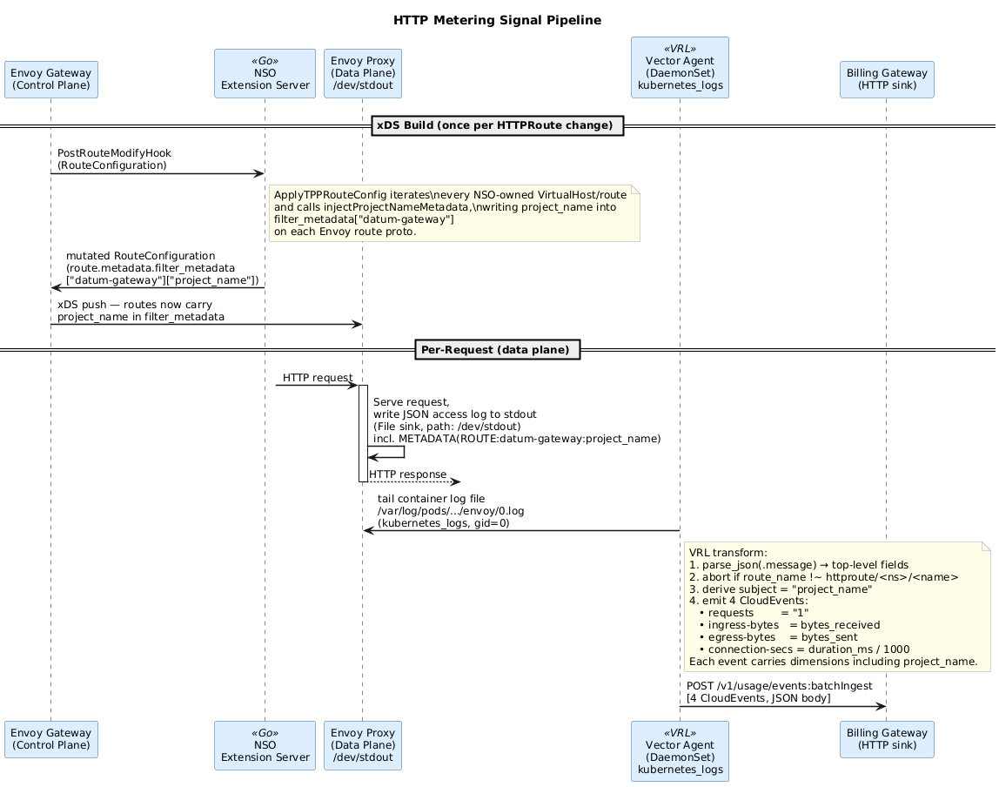

# HTTP Traffic Metering for Network Services

- [Summary](#summary)
- [Motivation](#motivation)
  - [Goals](#goals)
  - [Non-Goals](#non-goals)
- [Proposal](#proposal)
  - [Data and Control Flow Diagrams](#data-and-control-flow-diagrams)
  - [User Stories](#user-stories)
  - [Notes/Constraints/Caveats](#notesconstraintscaveats)
  - [Risks and Mitigations](#risks-and-mitigations)
- [Design Details](#design-details)
  - [Monitored Resource: HTTPRoute](#monitored-resource-httproute)
  - [Service and ServiceConfiguration Definitions](#service-and-serviceconfiguration-definitions)
  - [Kustomize Bundle Layout](#kustomize-bundle-layout)
- [Production Readiness Review Questionnaire](#production-readiness-review-questionnaire)
  - [Feature Enablement and Rollback](#feature-enablement-and-rollback)
  - [Rollout, Upgrade and Rollback Planning](#rollout-upgrade-and-rollback-planning)
  - [Monitoring Requirements](#monitoring-requirements)
  - [Dependencies](#dependencies)
  - [Scalability](#scalability)
  - [Troubleshooting](#troubleshooting)
- [Open Decisions](#open-decisions)
- [Implementation History](#implementation-history)
- [Drawbacks](#drawbacks)
- [Alternatives](#alternatives)

## Summary

Network Services operates an Envoy Gateway-based edge proxy that routes HTTP traffic, terminates TLS, and enforces WAF and rate-limit policies on behalf of platform customers. Today, it lacks a billing presence: there is no registration in the service catalog, no meter definitions, and no integration with the durable usage pipeline.

This enhancement defines the architecture, data structures, and metadata required to bring HTTP traffic metering and service catalog registration to Network Services. Under this design:
- Network Services' identity and billable metrics are declared via a standard `Service` and companion `ServiceConfiguration` resource (`services.miloapis.com/v1alpha1`).
- Envoy Gateway proxies are instrumented to write structured JSON access logs, which are scraped, parsed, and forwarded as CloudEvents to the platform's billing pipeline by the existing `billing-usage-collector-vector` DaemonSet.

## Motivation

Network Services is a core utility that incurs direct infrastructure costs. Capturing consumption signals is necessary for platform billing and cost-attribution. 

Because `MeterDefinition` fields (such as `meterName` and `measurement.unit`) are immutable once published, establishing correct definitions in the `Draft`/`Provisional` phase is critical. Doing so avoids costly SDK upgrades, meter deprecation cycles, and data migrations.

### Goals

- Establish Network Services' identity in the platform service catalog to make it discoverable and activatable by platform consumers.
- Define clear, usage-based billing metrics for HTTP traffic (requests, bandwidth, and connection time) so customers pay proportionally to their consumption.
- Design a reliable, zero-data-loss telemetry collection path that ensures accurate billing without impacting proxy performance or request latency.
- Provide clear architectural visibility into the edge-to-billing data flow for platform operators.

### Non-Goals

- **Pricing tiers, currencies, and billing cycle schedules:** This design only concerns measuring and reporting raw usage quantities. Determining pricing rates, tier discounts, billing schedules, and invoice calculations is out of scope.
- **Runtime traffic enforcement and quota limits:** Telemetry collection does not gate or throttle traffic. Rate limiting, WAF enforcement, and bandwidth capping remain governed by separate gateway policies, not by the billing pipeline.

## Proposal

We propose to register the service and implement HTTP traffic metering via access log scraping. 

- The **Monitored Resource** is the Kubernetes Gateway API `HTTPRoute` resource, representing the customer-facing HTTP endpoint.
- **Catalog Registration** is handled via declarative YAML configurations. The service catalog fan-out controller automatically creates `MonitoredResourceType` and `MeterDefinition` resources in the billing namespace.
- **Telemetry Emission** is handled by instrumenting the Envoy Gateway instances to write structured JSON access logs to stdout. The node-level `billing-usage-collector-vector` DaemonSet (already deployed as part of the billing pipeline) tails these log files directly, parses and maps the raw logs into CloudEvents, handles local disk buffering, and reliably forwards them to the central Billing System.

### Data and Control Flow Diagrams

#### System Container Architecture (C4 Container Diagram)

The following diagram outlines the relationship between the Edge Cluster components and the Platform Control Plane Billing Pipeline:


#### Operational Data Flow (Sequence Diagram)

The sequence below details the path of a client request, the generation of the telemetry log, and its propagation to the billing pipeline:


### User Stories

#### Story 1
As a platform customer, I want to deploy `HTTPRoute` resources to expose my services and pay only for the volume of requests and bandwidth my application consumes.

#### Story 2
As a platform administrator, I want to track active connections and bytes transferred per HTTPRoute in the billing portal to manage capacity and attribute costs to projects.

### Notes/Constraints/Caveats

- **Log Schema Locking:** Since Vector relies on parsing the Envoy stdout logs, any changes to the Envoy access log format must be carefully managed to avoid breaking the parsing pipeline.
- **Persistent Connections:** Traditional access logs only print a line once the request/connection finishes. For long-running connections (e.g. WebSockets), connection seconds are computed upon termination. We need to evaluate whether periodic sample-based heartbeats are required for extremely long connections (days/weeks).

### Risks and Mitigations

- **Risk:** High traffic volume (e.g. 10k+ requests per second) generating a high rate of log output, consuming excessive disk I/O and CPU.
  - *Mitigation:* Vector Agent performs on-node log parsing, batching, and compression, reducing transport overhead. Ingestion Gateways will be scaled horizontally to handle load peaks.
- **Risk:** Node restarts resulting in the loss of in-flight logs.
  - *Mitigation:* Standard Docker/Kubernetes container runtimes persist log files on the host disk, allowing the Vector Agent to resume tailing from the last read offset upon restart.

---

## Design Details

### Monitored Resource: HTTPRoute

Rather than tracking usage at the `Gateway` or `HTTPProxy` level, we meter consumption per **`HTTPRoute`**. This is because:
1. It maps directly to a customer's specific application service surface.
2. It separates L7 (HTTP) billing from future L4 (TCP/UDP) billing, which would be represented by `TCPRoute` or `UDPRoute` resources.

We define four billing metrics for `HTTPRoute` resources:

| Signal | Proposed Metric Name | Unit (UCUM) | Metric Kind |
|--------|----------------------|-------------|-------------|
| Request count | `networking.datumapis.com/gateway/requests` | `{request}` | Delta |
| Egress bytes | `networking.datumapis.com/gateway/egress-bytes` | `By` | Delta |
| Ingress bytes | `networking.datumapis.com/gateway/ingress-bytes` | `By` | Delta |
| Connection seconds | `networking.datumapis.com/gateway/connection-seconds` | `s` | Delta |

#### Dimensions

Each metric will record the following dimensions:
- `region`: Deployment region.
- `gateway`: Name of the parent Gateway.
- `gateway_namespace`: Namespace of the parent Gateway.
- `gateway_class`: Underlying GatewayClass (for pricing class differentiation).
- `httproute_name`: The `HTTPRoute` resource name.
- `httproute_namespace`: The `HTTPRoute` namespace.
- `project_name`: Human-readable name of the project that owns the route (see [Surfacing Signals from the Edge](#surfacing-signals-from-the-edge)).

---

### Surfacing Signals from the Edge



All metering signals originate from the **edge cluster**, where the Envoy
Gateway proxies (`datum-downstream-gateway`) actually serve customer traffic.
There is no central collection point that observes individual requests — the
proxy is the only component that sees each request, so the signal must be
captured, enriched, and emitted at the edge before being forwarded to the
central Billing System.

The raw access log already carries everything the meters need *except* one
thing: the `route_name` field identifies the owning project only by its
control-plane namespace UID (e.g. `ns-<project-uid>`), not by the
human-readable project name. To populate the `project_name` dimension, three
components collaborate at the edge:

1. **Extension Server (xDS mutation).** The NSO extension server implements
   `ApplyTPPRouteConfig` in `internal/extensionserver/mutate/tpp.go`. During
   each xDS route-config build, it iterates every VirtualHost owned by NSO and
   calls `injectProjectNameMetadata` on every route, which writes the resolved
   `project_name` string directly into
   `filter_metadata["datum-gateway"]["project_name"]` on the Envoy
   `RouteConfiguration` proto. This happens for every NSO-owned route
   regardless of whether a `TrafficProtectionPolicy` governs it — WAF config is
   an optional overlay on top of the metadata that is always stamped. The
   project name is sourced from `idx.ProjectNames[dsNS]`, the
   downstream-namespace → project-name mapping the operator maintains in its
   policy index.

2. **Envoy access log format.** The `EnvoyProxy` access log JSON format
   includes a `project_name` field read from the xDS route metadata:
   `project_name: "%METADATA(ROUTE:datum-gateway:project_name)%"`. Because the
   extension server stamps the metadata into the xDS route before any request is
   served, every logged request for a customer route carries the resolved
   project name. (`%METADATA(ROUTE:...)%` is used because the name lives in xDS
   route metadata — it is not a per-request value and does not need to travel as
   a header.)

3. **Vector billing collector.** The `billing-usage-collector-vector` VRL
   transform reads the `project_name` field from each parsed access log line
   and adds it as a dimension on all four emitted CloudEvents (requests,
   ingress-bytes, egress-bytes, connection-seconds). An absent or Envoy-default
   `"-"` value is normalized to an empty string so unmatched routes do not
   pollute the dimension.

This keeps the entire signal path — xDS route enrichment, log emission,
parsing, and CloudEvent forwarding — co-located on the edge cluster.

#### Transport: how access logs reach Vector

The access log line travels from the Envoy proxy to the
`billing-usage-collector-vector` agent via the **File sink (stdout) +
`kubernetes_logs`** approach: Envoy writes JSON to `/dev/stdout` (the `File`
sink configured on `datum-downstream-gateway`) and the node-local Vector
DaemonSet tails the container log file via its `kubernetes_logs` source.

---

### Service and ServiceConfiguration Definitions

#### `service.yaml`
```yaml
apiVersion: services.miloapis.com/v1alpha1
kind: Service
metadata:
  name: networking-datumapis-com
  labels:
    app.kubernetes.io/name: network-services-operator
    app.kubernetes.io/managed-by: kustomize
spec:
  serviceName: networking.datumapis.com
  phase: Draft
  displayName: Network Services
  description: |
    Managed HTTP/HTTPS edge proxy, routing, and traffic protection
    for Datum Cloud workloads. Provides programmable ingress via
    Gateway API HTTPRoute and WAF/rate-limit policies. Billed via
    the networking.datumapis.com/gateway meter family.
  owner:
    producerProjectRef:
      name: datum-cloud
```

#### `serviceconfiguration.yaml`
```yaml
apiVersion: services.miloapis.com/v1alpha1
kind: ServiceConfiguration
metadata:
  name: networking-datumapis-com
spec:
  phase: Draft
  serviceRef:
    name: networking-datumapis-com
  monitoredResourceTypes:
    - type: networking.datumapis.com/HTTPRoute
      displayName: HTTP Route
      description: |
        A customer-defined HTTP routing configuration attached to a managed
        Gateway. One HTTPRoute represents a single HTTP service surface on
        the Datum Cloud edge. Usage events cover proxied request count,
        egress bytes, ingress bytes, and active connection seconds.
      gvk:
        group: gateway.networking.k8s.io
        kind: HTTPRoute
      labels:
        - name: region
          description: Datum deployment region serving the requests.
        - name: gateway
          description: Name of the underlying Gateway resource.
        - name: gateway_namespace
          description: Namespace of the underlying Gateway resource.
        - name: gateway_class
          description: GatewayClass of the underlying Gateway.
        - name: httproute_name
          description: Name of the HTTPRoute that served the request.
        - name: httproute_namespace
          description: Namespace of the HTTPRoute that served the request.
  metrics:
    - name: networking.datumapis.com/gateway/requests
      displayName: HTTP Route Requests
      description: HTTP requests proxied through the route.
      kind: Delta
      unit: "{request}"
      dimensions:
        - region
        - gateway
        - gateway_namespace
        - gateway_class
        - httproute_name
        - httproute_namespace
    - name: networking.datumapis.com/gateway/egress-bytes
      displayName: HTTP Route Egress Bytes
      description: Bytes sent downstream by the route.
      kind: Delta
      unit: By
      dimensions:
        - region
        - gateway
        - gateway_namespace
        - gateway_class
        - httproute_name
        - httproute_namespace
    - name: networking.datumapis.com/gateway/ingress-bytes
      displayName: HTTP Route Ingress Bytes
      description: Bytes received from clients by the route.
      kind: Delta
      unit: By
      dimensions:
        - region
        - gateway
        - gateway_namespace
        - gateway_class
        - httproute_name
        - httproute_namespace
    - name: networking.datumapis.com/gateway/connection-seconds
      displayName: HTTP Route Connection Seconds
      description: Seconds long-lived connections (e.g. WebSocket) are held open.
      kind: Delta
      unit: s
      dimensions:
        - region
        - gateway
        - gateway_namespace
        - gateway_class
        - httproute_name
        - httproute_namespace
  billing:
    consumerDestinations:
      - monitoredResourceType: networking.datumapis.com/HTTPRoute
        metrics:
          - networking.datumapis.com/gateway/requests
          - networking.datumapis.com/gateway/egress-bytes
          - networking.datumapis.com/gateway/ingress-bytes
          - networking.datumapis.com/gateway/connection-seconds
```

### Kustomize Bundle Layout

We package these files following the project-standard layout pattern:

```
config/services/
  kustomization.yaml
  networking.datumapis.com/
    kustomization.yaml
    service.yaml
    serviceconfiguration.yaml
    README.md
```

---

## Production Readiness Review Questionnaire

### Feature Enablement and Rollback

#### How can this feature be enabled / disabled in a live cluster?
- **Other**
  - Describe the mechanism: Catalog registration is enabled by deploying the `Service` and `ServiceConfiguration` manifests. Telemetry emission is enabled by configuring the Envoy Gateway access logs via `EnvoyProxy` and updating the `billing-usage-collector-vector` DaemonSet configuration.
  - Will enabling / disabling the feature require downtime of the control plane? No.
  - Will enabling / disabling the feature require downtime or reprovisioning of a node? No, Envoy Gateway supports dynamic configuration updates without dropping active traffic.

#### Does enabling the feature change any default behavior?
No, it only adds background logging and telemetric forwarding.

#### Can the feature be disabled once it has been enabled (i.e. can we roll back the enablement)?
Yes, reverting the `EnvoyProxy` configuration to its previous state disables access logging.

#### What happens if we reenable the feature if it was previously rolled back?
Logging resumes, and `billing-usage-collector-vector` resumes parsing from the end of the log stream.

---

### Rollout, Upgrade and Rollback Planning

#### How can a rollout or rollback fail? Can it impact already running workloads?
Rollouts do not affect traffic handling directly. A malformed access log format patch could cause Vector parsing errors, leading to missing billing data but leaving request routing functional.

#### What specific metrics should inform a rollback?
- Vector agent parsing error rates (`vector_transform_errors_total`).
- Billing Ingestion Gateway event rejection rate.

#### Were upgrade and rollback tested? Was the upgrade->downgrade->upgrade path tested?
TBD during telemetry emission implementation.

---

### Monitoring Requirements

#### How can an operator determine if the feature is in use by workloads?
By checking the presence of incoming CloudEvents at the Billing Ingestion Gateway carrying the `networking.datumapis.com` source domain.

#### How can someone using this feature know that it is working for their instance?
By checking the customer billing dashboard or querying the billing API for resource usage statistics.

#### What are the SLIs (Service Level Indicators) an operator can use to determine the health of the service?
- **Metrics**
  - Metric name: `vector_transform_errors_total`, `ingestion_gateway_request_count` (with status codes).
  - Components exposing the metric: `billing-usage-collector-vector`, Billing Ingestion Gateway.

---

### Dependencies

#### Does this feature depend on any specific services running in the cluster?
- **`billing-usage-collector-vector` DaemonSet:** Tails Envoy container logs, parses JSON access logs, translates to CloudEvents, and forwards events to the Billing System.

---

### Scalability

#### Will enabling / using this feature result in any new API calls?
- Logs are written locally to stdout; there are no new Kube API calls for logging.
- `billing-usage-collector-vector` performs HTTPS batch POST requests to the Billing System. Throughput scales linearly with request volume.

#### Will enabling / using this feature result in introducing new API types?
No new Go-level types are introduced in the operator. `Service` and `ServiceConfiguration` are existing types in the platform's service catalog.

---

### Troubleshooting

#### How does this feature react if the API server is unavailable?
Telemetry generation and log scraping are independent of the Kubernetes API server. `billing-usage-collector-vector` will continue to tail files and forward events.

#### What are other known failure modes?
- **Vector pipeline backlog:** If the Ingestion Gateway/Billing System is slow, `billing-usage-collector-vector` buffers events locally on the node disk.
- **Log rotation race:** Very high traffic might trigger rapid log rotation, which could cause minor data loss if the collector falls too far behind.

## Open Decisions

The following decisions are tracked for the implementation of this enhancement:

| ID | Question | Status | Resolution |
|----|----------|--------|------------|
| OD-1 | How does the service catalog express the monitored resource? | **Resolved** | Via `services.miloapis.com/v1alpha1/ServiceConfiguration` carrying `spec.monitoredResourceTypes[]`, `spec.metrics[]` and `spec.billing` inline. The fan-out controller produces the `MonitoredResourceType` and meter resources in the billing namespace. |
| OD-2 | Canonical `serviceName` | **Resolved** | `networking.datumapis.com`. |
| OD-3 | `producerProjectRef.name` | **Resolved** | `datum-cloud`. |
| OD-4 | Bundle layout | **Resolved** | Per-service-domain directory under `config/services/networking.datumapis.com/`, matching `datum-cloud/datum/config/services/<service-domain>/`. |
| OD-5 | Is the Vector Agent DaemonSet planned to run on the edge cluster nodes that host Envoy Gateway pods? | **Resolved** | Yes. The shared platform `billing-usage-collector-vector` runs as a DaemonSet in the `billing-system` namespace. Under this design, this pre-existing agent will directly tail and parse the Envoy stdout logs, avoiding the need for a separate custom log-parsing agent. |
| OD-6 | Can the network-services-operator patch the `EnvoyProxy` CR to inject access log configuration? | **Resolved** | Yes. NSO configures and manages the Envoy Gateway proxies and can patch EnvoyProxy resources to enable structured JSON stdout logging. |
| OD-7 | Is the billing SDK published as a consumable Go module? | **N/A** | We do not compile or use the Billing Go SDK for proxy traffic metering. Instead, the `billing-usage-collector-vector` DaemonSet directly parses raw Envoy stdout logs, formats them into CloudEvents, and forwards them. |
| OD-8 | Enrichment-sidecar placement: per-node alongside Vector, or central in front of the Ingestion Gateway? | **N/A** | At this stage, we will not enrich the event information with additional control-plane data. The `billing-usage-collector-vector` DaemonSet will only parse the raw properties from the JSON logs and map them directly to the CloudEvent schema. |

---

## Implementation History

- **2026-06-10:** Refactored design brief into standard enhancement proposal, reframing the goal around HTTP Traffic Metering and adding C4 and sequence diagrams.

---

## Drawbacks

- **Log Volume Overhead:** Emitting and parsing logs for every request adds disk I/O and CPU load on the node.
- **Complexity of Connection Seconds:** Persisting connection duration for WebSockets requires tracking state until connection termination.

---

## Alternatives

### Access Log Transport: File Sink vs OTLP Sink

The signal-collection design above is independent of *how* the Envoy access log
line reaches the `billing-usage-collector-vector` agent. Two transports were
evaluated:

#### Option A1: File sink (stdout) + Vector `kubernetes_logs` (baseline)

Envoy keeps its existing `File` access log sink writing JSON to `/dev/stdout`.
The container runtime persists this to the node's container log files, and
Vector tails them via a `kubernetes_logs` source.

- *Pros:* No new ports or network hops; reuses the standard Kubernetes log
  collection pattern; the `File` sink is already present in the base
  `EnvoyProxy`; logs survive on disk if Vector is briefly down (checkpointed
  tailing).
- *Cons:* Requires Vector to run as a **per-node DaemonSet co-located** with the
  Envoy pod, because `kubernetes_logs` can only read the node it runs on. This
  holds on **edge** clusters (Vector and Envoy are both DaemonSets), but breaks
  where the billing Vector runs as a **Stateless-Aggregator** (staging/prod), as
  a single aggregator pod cannot tail Envoy stdout on other nodes. It also needs
  a `kubernetes_logs` source plus a ClusterRole for pod metadata, pod-label
  filtering to avoid ingesting unrelated containers, and a `parse_json(.message)`
  step.

#### Option A2: OpenTelemetry (OTLP) sink (implemented in draft PR)

Envoy adds an `OpenTelemetry` access log sink alongside the existing `File`
sink, pushing access logs directly to Vector's OTLP receiver
(`opentelemetry` source, gRPC :4317). The JSON fields arrive as OTLP
log-record attributes, which the VRL transform normalizes to top-level fields.

- *Pros:* **Topology-independent** — works identically whether Vector is a
  DaemonSet or an aggregator, since it targets the Vector Service DNS and lets
  kube-proxy route. No `kubernetes_logs` source, no ClusterRole, no
  per-container filtering, no re-parsing of a stringified message. An OTel
  resource attribute (`service.name: nso-httproute-signals`) tags the stream.
- *Cons:* Adds a network sink and OTLP ports to the Vector Service; introduces a
  push dependency (mitigated by keeping the `File` sink in parallel as a
  fallback / for debugging).

This transport is implemented in a draft PR:

<!-- TODO: reference the draft PR here -->
PR:


### Option B: Prometheus Scrape Delta Calculation
Run an operator loop that polls the Envoy `/stats` endpoint periodically.
- *Rejected because:* Loses per-request granularity and increases NSO statefulness/risk of double-counting.

### Option C: gRPC Metrics Sink (OTel OTLP)
Configure Envoy's OTel metrics sink to push counters via gRPC OTLP to a platform-deployed OTel Collector.
- *Rejected because:* The billing pipeline design document explicitly rejects the OTLP path, since OTLP does not structurally enforce the ULID dedup key or the billing entity (`subject`). These fields would become opaque string attributes that must survive the OTLP round-trip intact.

### Option D: WASM Filter Hook
Inject a Custom WASM Filter to accumulate and batch statistics within the proxy.
- *Rejected because:* Introduces build-time overhead (a separate Rust WASM repository/OCI image) and increases operational complexity compared to using standard Vector log parsing.

