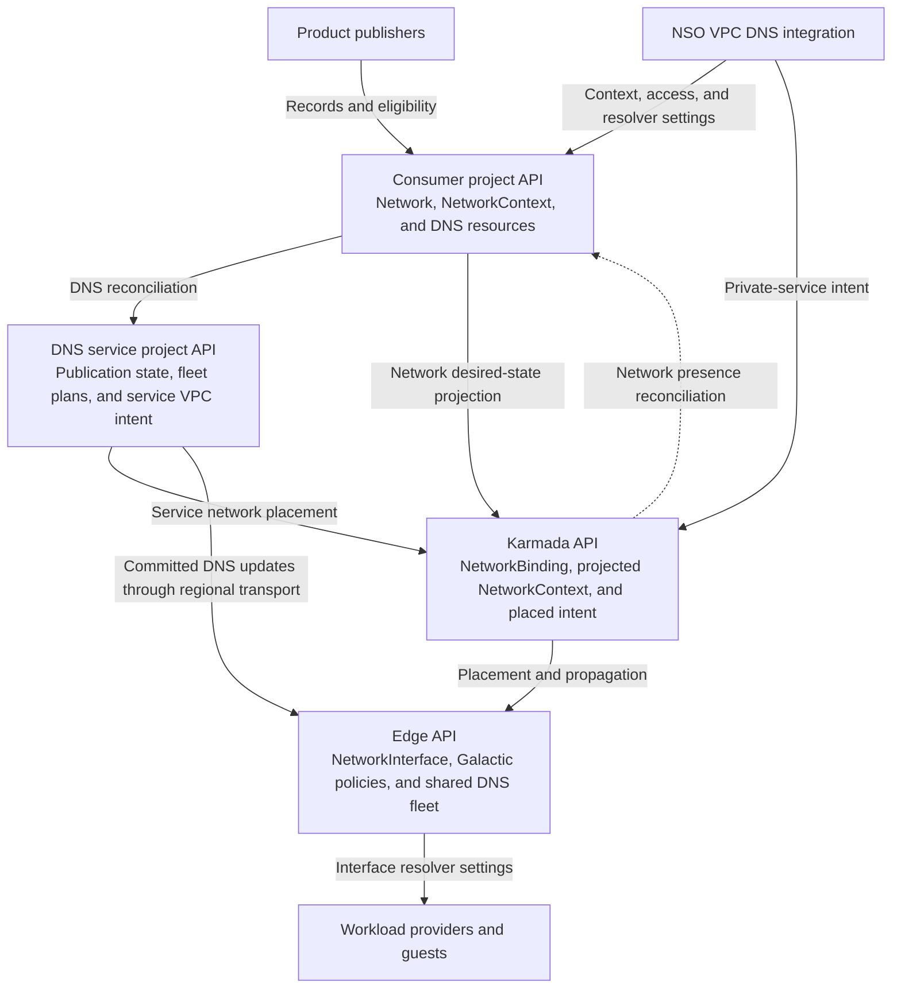
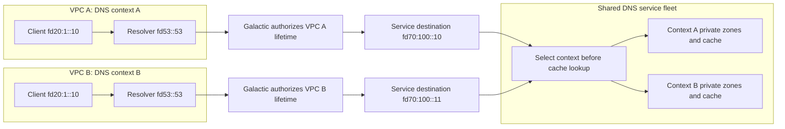

# Internal DNS for VPC resources

Tracking issue: [Internal DNS for Galactic VPC](https://github.com/datum-cloud/enhancements/issues/921).

- [Summary](#summary)
- [Motivation](#motivation)
  - [Goals](#goals)
  - [Non-Goals](#non-goals)
- [Proposal](#proposal)
  - [User stories](#user-stories)
  - [Risks and mitigations](#risks-and-mitigations)
- [Design Details](#design-details)
  - [Control-plane boundaries](#control-plane-boundaries)
  - [Network identity](#network-identity)
  - [API design](#api-design)
  - [Publication and lifecycle](#publication-and-lifecycle)
- [Production Readiness Review Questionnaire](#production-readiness-review-questionnaire)
- [Implementation History](#implementation-history)
- [Drawbacks](#drawbacks)
- [Alternatives](#alternatives)
- [Infrastructure Needed](#infrastructure-needed)

## Summary

Resources attached to a virtual private cloud (VPC) receive private DNS names and resolver settings automatically. The network services operator (NSO) provisions VPC DNS access and carries resolver settings to workload providers. Product services publish their records and endpoint eligibility.

## Motivation

Users need stable names for resources whose addresses and health change. Attaching a resource to a VPC should provide DNS access without requiring a zone choice or resolver configuration on each resource.

### Goals

- Resolve automatic resource names and multiple associated private zones within a VPC.
- Preserve tenant isolation across projects, locations, and overlapping addresses.
- Deliver resolver settings through the network-interface contract.
- Withdraw expired access and ineligible endpoints during control-plane outages.

### Non-Goals

- Implementing DNS serving engines or Galactic packet forwarding.
- Defining Compute APIs, guest configuration mechanisms, or application health policies.
- Discovering arbitrary services on connected networks.

## Proposal

NSO provisions one DNS context per enabled VPC and regional access wherever the network is used. The context selects the VPC's private zones. Workloads receive the well-known resolver address `fd53::53` through their network interfaces.

DNS allocates a managed namespace for automatic product names. Users can associate additional private zones and naming policies through the DNS API. Shared regional fleets serve many VPCs without per-VPC deployments.

### User stories

A workload attaches to its VPC and receives resolver settings from its provider. The user queries the assigned names with the guest's default resolver:

```console
$ dig +short AAAA web-01.instances.vpc-a7c9.project-p4e2.internal
fd20:1::10
$ dig +short AAAA database.exports.vpc-a7c9.project-p4e2.internal
fd20:1::20
$ dig +short AAAA api.prod.internal
fd20:1::30
```

The first two names represent automatic Compute and Connect publications. The third belongs to an explicitly associated custom zone. Names, suffixes, and addresses are illustrative. Public names also resolve through the VPC resolver.

### Risks and mitigations

- Cross-VPC disclosure: authorize the VPC lifetime and service destination before lookup; test overlapping names and forged identities.
- Stale configuration: preserve authorization deadlines through every projection and enforce expiry at the edge.
- Ambiguous guest routing: qualify resolver selection for workloads with multiple network interfaces before enabling that configuration.

## Design Details

### Control-plane boundaries

The diagram identifies API ownership. Controllers use authenticated, project-scoped clients regardless of where their processes run.



- **Consumer project:** Owns the logical network, location-scoped network contexts, DNS resources, and product publications. NSO owns DNS access intent; DNS owns serving status.
- **DNS service project:** Owns shared serving plans, publication delivery, and the DNS service's VPC. DNS controllers consume DNS intent without reading product or networking APIs.
- **Karmada:** Owns network-use declarations and propagates network and workload desired state. Resolver settings follow network presence; DNS publications use regional transport.
- **Edge:** Owns local interfaces, private-service programming reports, and serving state. NSO derives interface settings from the propagated context; providers apply them to guests.

A project UID and Network UID identify the VPC lifetime. Its network contexts share one DNS context. NSO maps locations to regions through trusted platform configuration; each active region has its own access binding in the project API.

### Network identity

The DNS service runs in its own VPC. Galactic exposes an authorized private endpoint in each consumer VPC and translates its destination to a unique service-side address.



DNS selects the context from the authorized service destination before cache lookup. Client source addresses, query metadata, and client-supplied proxy headers cannot select a context. Galactic consumes generic `ServiceEndpoint` and `ServiceRoutePolicy` intent; it does not interpret DNS contexts or zones.

### API design

These examples are proposed contracts. NSO fields below are additions requiring API implementation. DNS examples use the [DNS control-plane contract](https://github.com/datum-cloud/dns-operator/pull/229). UIDs and deadlines are illustrative; controllers write the generated objects and status.

#### Network policy and DNS access

```yaml
apiVersion: networking.datumapis.com/v1alpha
kind: Network
metadata:
  name: application
spec:
  ipam:
    mode: Auto
  dns:
    # Proposed optional policy. Managed is the default for enabled VPCs.
    # Disabled requests withdrawal of managed resolver access and settings.
    mode: Managed
---
apiVersion: dns.networking.miloapis.com/v1alpha1
kind: DNSResolverContext
metadata:
  name: application
spec:
  # NSO derives this immutable identity from project UID and Network UID.
  consumerID: "11111111-1111-4111-8111-111111111111/22222222-2222-4222-8222-222222222222"
  managedNamespace:
    # DNS allocates the default zone and suffix for product publishers.
    enabled: true
---
apiVersion: dns.networking.miloapis.com/v1alpha1
kind: DNSResolverAccessBinding
metadata:
  name: application-us-central-1
spec:
  # Pin the DNS context lifetime in the consumer project API.
  contextRef:
    name: application
    uid: 33333333-3333-4333-8333-333333333333
  # A trusted location mapping selects the regional shared fleet.
  region: us-central-1
  queryIdentity:
    type: DestinationAddress
    # Authorize the service-side destination, distinct from fd53::53.
    value: fd70:100::10
  port: 53
  transports: [UDP, TCP]
  authorization:
    # DNS issues the context epoch; NSO preserves it on renewals.
    writerEpoch: 3
    # Persist monotonic renewal sequences using conditional API writes.
    sequence: 27
    # Preserve the authorization deadline during replication.
    validUntil: "2026-10-09T20:05:00Z"
```

NSO creates access only for an authorized network location. It coordinates the DNS binding with generic private-service intent that pins the consumer VPC lifetime and backend destination. Users and record publishers cannot authorize their own network access.

#### Resolver settings delivered to workloads

NSO writes verified resolver settings into the project `NetworkContext.spec.dns`. Federation carries that desired state to the edge. The interface controller copies it into `NetworkInterface.spec.dns`; providers consume the interface rather than reading DNS or network-context APIs.

```yaml
apiVersion: networking.datumapis.com/v1alpha
kind: NetworkContext
metadata:
  name: application-us-central-1
spec:
  network:
    name: application
  location:
    name: us-central-1
  dns:
    # Proposed NSO-owned desired state, protected from consumer writes.
    contextRef:
      name: application
      uid: 33333333-3333-4333-8333-333333333333
    # Preserve source access identity and revision across control planes.
    accessBindingRef:
      name: application-us-central-1
      uid: 44444444-4444-4444-8444-444444444444
    writerEpoch: 3
    sequence: 27
    # The deadline cannot exceed either DNS or network authorization.
    validUntil: "2026-10-09T20:05:00Z"
    # The private-service frontend uses this address inside the consumer VPC.
    nameservers: [fd53::53]
    # Use the DNS-allocated managed suffix for relative names.
    searches: [vpc-a7c9.project-p4e2.internal]
---
apiVersion: networking.datumapis.com/v1alpha
kind: NetworkInterface
metadata:
  name: web-01-eth0
spec:
  network:
    name: application
  interfaceName: eth0
  # Proposed inherited settings have exactly the NetworkContext.dns shape.
  dns:
    contextRef:
      name: application
      uid: 33333333-3333-4333-8333-333333333333
    accessBindingRef:
      name: application-us-central-1
      uid: 44444444-4444-4444-8444-444444444444
    writerEpoch: 3
    sequence: 27
    validUntil: "2026-10-09T20:05:00Z"
    nameservers: [fd53::53]
    searches: [vpc-a7c9.project-p4e2.internal]
```

Admission restricts resolver-settings writes to NSO and `DNSConfigured` reports to trusted providers. Authenticate source projects through project routing and protected federation metadata. Projections preserve source identity and fencing values; UIDs assigned to replicated copies cannot replace source lifetimes.

Publish settings only after DNS reports the access sequence ready and Galactic reports the corresponding policy generation programmed on required nodes. `NetworkContext` reports a proposed `DNSReady` condition separately from network readiness. Providers report `DNSConfigured` after applying current, unexpired settings, reconcile updates, and reject stale revisions.

The initial guest contract supports one managed DNS context. A provider must reject unsupported combinations of managed contexts across interfaces rather than merge private resolver settings. A transient failure must not redirect private queries to a public resolver.

### Publication and lifecycle

Products reserve names through `DNSRegistration` and publish eligible addresses through `DNSContribution`. A trusted issuer authorizes publishers through `DNSContributionGrant`; publication credentials cannot write grants or resolver access. Compute owns instance and service eligibility; Connect owns export eligibility. DNS and NSO do not inspect Compute resources.

Reconcile access, publication, and settings independently per project and region. Persist sequences, use conditional writes, and resume from committed state after takeover. Failure in one region must not block healthy regions. Replication and retries preserve expiry times.

Products withdraw unhealthy endpoints; DNS also expires contributions locally when publishers stop. Withdrawal bounds include cached-answer TTLs. Removing a location's last consumer clears its settings; removing the region's last consumer stops access renewal. Network deletion retires the DNS context. Recreated networks and retained interfaces cannot inherit retired authorization.

## Production Readiness Review Questionnaire

### Feature Enablement and Rollback

Gate VPC integration and product publication separately, disabled by default for alpha. Enable selected staging projects first. Withdrawal stops renewals, gates private paths, and removes guest settings through provider reconciliation. Stopping controllers alone does not remove guest settings.

### Rollout, Upgrade and Rollback Planning

Extend the shared NSO federation and DNS Kubernetes test environments. Release acceptance requires guest-default queries from two VPCs with overlapping names and addresses, over UDP and TCP. Test takeover, replay, API and broker outages, health withdrawal, deletion, and rollback. Public DNS must follow the configured resolution policy.

### Monitoring Requirements

Measure renewal failures, settings age, guest-configuration time, and withdrawal latency. Users can inspect assigned names and DNS readiness. Operators trace context, access, route programming, interface, and serving reports.

### Dependencies

Require DNS serving and project APIs, authenticated clients, trusted federation metadata, Galactic private connectivity, and providers that refresh resolver settings. During API outages, authorization expires locally and unverified settings stay unready.

### Scalability

Locations sharing a regional path share access. Interface settings scale with interfaces; publications scale with endpoints. Qualify renewal throughput, controller sharding, and bounded search lists before increasing the canary cohort.

### Troubleshooting

Inspect `DNSReady` and `DNSConfigured`, then correlate source project, context UID, access UID, epoch, sequence, and deadline. Querying an explicit resolver address does not verify guest configuration.

## Implementation History

This enhancement is provisional. Release acceptance criteria require qualification before enablement.

## Drawbacks

Guest DNS readiness depends on both serving and private connectivity. Frequent lease renewals and interface updates consume API capacity and require bounded fan-out.

## Alternatives

Users can configure resolvers and publish static records manually. That approach does not provide automatic names or health-driven withdrawal.

## Infrastructure Needed

Shared regional DNS fleets in a service VPC, protected publication transport, producer VPC attachments, and consumer private endpoints. Use the [staging preparation stack](https://github.com/datum-cloud/infra/pull/6862) as the infrastructure boundary.

Related designs: [network presence](../network-in-every-location.md), [network interfaces](../network-interfaces.md), [internal DNS](https://github.com/datum-cloud/dns-operator/pull/229), and [Private Service Connect](https://github.com/datum-cloud/galactic/blob/main/docs/enhancements/networking/private-service-connect/README.md).
