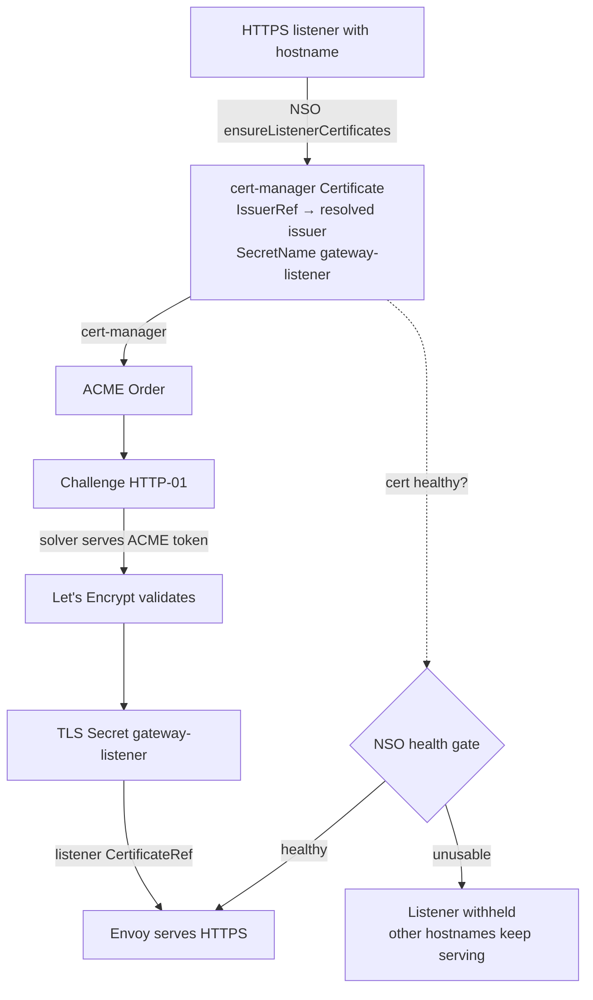

# Gateway certificate issuance model

How a Gateway/HTTPProxy HTTPS hostname becomes an issued, served TLS certificate — who owns each step, which issuance path a cert takes, and where it breaks.

This is the **model**. For alert response, see the runbook: [Gateway TLS certificate alerts](runbooks/gateway-tls-certificates.md).

## Who owns what

| Component | Responsibility |
| --- | --- |
| **NSO** (this operator) | Creates one cert-manager `Certificate` per HTTPS listener that owns a hostname. Selects the issuer. Gates listeners on cert health. Wires HTTP-01 solver routes when the downstream solver is enabled. Deletes/recreates failed certs. |
| **cert-manager** | Issues the certificate: drives the ACME `Order` → `Challenge` flow, writes the `Secret`. NSO does not talk ACME. |
| **Deployer** | Provides the issuer NSO references (`ClusterIssuer`/`Issuer`), and makes the hostname's DNS point at the gateway. NSO assumes both exist; it creates neither. |
| **external-dns** | Publishes hostname DNS when DNS integration is enabled (out of the ACME path but a prerequisite for HTTP-01). |
| **Envoy Gateway** | Programs the listener; serves the `Secret`; serves the solver route during a challenge. |

## End to end

Per HTTPS listener that owns a hostname, NSO creates a `Certificate` named `<gateway>-<listener>` populating a `Secret` of the same name; the downstream listener references that `Secret`. cert-manager issues; NSO gates the listener on the result.

Source: `internal/controller/gateway_controller.go` — `ensureListenerCertificates` (creates the `Certificate`), `listenerCertHealth` (gating), `listenerCertificateSecretName`/`listenerCertificateName` (naming).

Wildcard-covered hostnames (`*.<targetDomain>` / `<targetDomain>`) skip per-listener issuance and use the shared secret `defaultListenerTLSSecretName` when one is configured.

## The two issuance paths

A listener cert reaches the data plane one of two ways:

1. **Hub issue + propagate.** cert-manager issues where the operator runs; the resulting `Secret` is distributed to the data plane out of band (e.g. by Karmada). The member does not solve.
2. **Downstream (member) solve.** With `enableDownstreamCertificateSolver: true`, the challenge is solved in place on the member. NSO's downstream solver serves the ACME HTTP-01 response from the gateway itself.

**Tell which path a live cert took** from the backing `Secret`'s provenance: a hub-issued Secret arrives via propagation and has no local `Order`/`Challenge` chain on the member; a member-solved cert has its `Certificate`/`Order`/`Challenge` and an NSO-created solver `HTTPRoute` on the member.

## Issuer selection — and issuer *kind*

NSO does not pick an issuer implicitly. It resolves a name and writes it onto the `Certificate`:

- The listener's `gateway.networking.datumapis.com/certificate-issuer` TLS option is the issuer name.
- `clusterIssuerMap` translates that name (external → internal). No entry ⇒ used as-is.
- The `auto` sentinel (the default `listenerTLSOptions` value) resolves to the first real issuer found on any TLS listener of the same gateway (`resolveAutoIssuer`). No real issuer to inherit ⇒ the listener is left un-programmed rather than given an unresolvable ref.

**NSO writes `IssuerRef.Kind: ClusterIssuer`** (`gateway_controller.go` `ensureListenerCertificates`). Both NSO cert controllers act **only** on that kind:

- The downstream solver skips any Challenge whose `Certificate` issuer is not a `ClusterIssuer` in `clusterIssuerMap` (`gateway_downstream_certificate_solver_controller.go`).
- The errored-challenge deleter matches the same `ClusterIssuer` set (`challenge_controller.go` `isGatewayRelatedIssuer`).

So the **`ClusterIssuer` named in `clusterIssuerMap` is the issuer for the `certificate-issuer: auto → <ClusterIssuer>` opt-in path — it is not automatically the issuer of every per-tenant listener cert.** A deployment may instead issue ordinary per-tenant listener certs through a **namespaced `Issuer`** (one per gateway, in the tenant namespace), solved by cert-manager's own gateway-shim against the same gateway — a separate mechanism NSO's `clusterIssuerMap` solver deliberately ignores. That per-gateway `Issuer` is deployment wiring; on Datum it is generated by a Kyverno `ClusterPolicy`. The design reason for per-gateway/namespaced over one shared `ClusterIssuer`: cert-manager's HTTP-01 solver attaches its solver route to the gateway the issuer references, so a single shared `ClusterIssuer` pointing at a separate verifier gateway causes duplicate-hostname conflicts when programming Envoy.

Reading `clusterIssuerMap: auto → <issuer>` as "the issuer of the tenant gateway cert" is the exact misread that hid [infra#3410](https://github.com/datum-cloud/infra/issues/3410); always confirm which issuer *kind* backs the `Certificate` you are debugging.

## Upstream → downstream projection

NSO reconciles upstream intent into the downstream cluster (`internal/downstreamclient/`). The `Certificate` is created in the downstream gateway namespace, labeled with its upstream owner (`compute.datumapis.com/upstream-namespace` and the upstream-owner labels), and set controlled-by the downstream `Gateway`. That ownership chain — `Challenge` → `Order` → `Certificate` → `Gateway` — is what the downstream solver walks to find the gateway a challenge belongs to.

## HTTP-01 solver path (downstream solve)

When `enableDownstreamCertificateSolver: true`, for each `Challenge` on a matching `ClusterIssuer` cert owned by a gateway, NSO's solver creates, on the member:

- an Envoy Gateway `HTTPRouteFilter` returning a `200` direct response containing the ACME key, and
- an `HTTPRoute` on the owning gateway matching `/.well-known/acme-challenge/<token>` with that filter.

Both are labeled `meta.datumapis.com/http01-solver: "true"` and owned by the `Challenge`, so they are garbage-collected when the challenge resolves. NSO watches `Challenge`s (not `Certificate`s) so renewals are handled the same as first issuance.

Source: `gateway_downstream_certificate_solver_controller.go`.

## Config reference

`internal/config/config.go`, under `gateway:`:

| Field | Meaning |
| --- | --- |
| `enableDownstreamCertificateSolver` | Turn on the downstream solver. Needed only when the downstream cluster is a federation control plane (e.g. Karmada). |
| `clusterIssuerMap` | Map external issuer name → internal `ClusterIssuer` name. Also the allowlist the solver and challenge-deleter key on. |
| `listenerTLSOptions` | Default TLS options stamped on generated listeners; ships `certificate-issuer: auto`. |
| `deleteErroredChallenges` | Delete errored ACME `Challenge`s for matching issuers to force a fresh retry. Default `true`. |
| `defaultListenerTLSSecretName` | Pre-provisioned shared secret for wildcard-covered listeners; must exist in every downstream gateway namespace. |
| `certificateReissuance.retryInterval` / `.maxRetries` | Bounds for automatic re-issuance (below). |

**NSO creates:** the per-listener `Certificate`; the solver `HTTPRoute`/`HTTPRouteFilter`.
**Deployer must already provide on the member:** the `ClusterIssuer`/`Issuer` the `Certificate` references, and DNS pointing the hostname at the gateway.

## Automatic re-issuance ([#259](https://github.com/datum-cloud/network-services-operator/issues/259))

cert-manager backs off exponentially after repeated ACME failures, which can strand a recoverable cert for a long time. NSO fast-tracks recovery: once a `Certificate`'s `LastFailureTime` is older than `retryInterval`, NSO deletes it, which GCs the whole `CertificateRequest`/`Order`/`Challenge`/solver-route chain and recreates it fresh next reconcile. The attempt count is tracked as an annotation on the downstream `Gateway` (so it survives cert deletion) and is bounded by `maxRetries`, after which NSO defers to cert-manager's own backoff. A recovered cert clears its count.

Source: `gateway_controller.go` `reissueFailedCertificate`.

**This assumes the member can issue.** Re-issuance retries against a missing issuer or off-gateway DNS unchanged — it recovers a transient failure, it does not fix a wiring fault.

## Failure modes

| Symptom | Cause | Owner |
| --- | --- | --- |
| `Referenced "ClusterIssuer" not found` on the member | The issuer NSO's `Certificate` references is absent where the cert is solved. NSO assumes it exists. | Deployer — create the issuer. |
| HTTP-01 `Challenge` stuck `pending`, self-check `wrong status code '404'` | The ACME probe never reaches the gateway; the challenge is presented but the hostname's DNS does not point at the gateway. Not an issuer problem. | Customer/DNS — point the hostname at the gateway. |
| Split cert readiness on one gateway (one listener `Ready`, another `NotReady`) | The two listeners use different issuer *kinds*/paths. Check each `Certificate`'s `IssuerRef` before assuming a propagation bug. | Inspect per listener. |
| Listener withheld, hostname not serving HTTPS | NSO gated an unusable cert (expired/missing/mismatched/not-yet-issued); isolation working as intended. | See runbook. |

Status surfaces on the upstream `Gateway`'s listener conditions: a gated listener reports `Programmed: False` (`Invalid`) and `ResolvedRefs: False` (`InvalidCertificateRef`) with a plain-language message. Backing `Certificate`/`Secret` live downstream as `<gateway>-<listener>`.

Debug entry points and alert response: [Gateway TLS certificate alerts](runbooks/gateway-tls-certificates.md). Related: [#212](https://github.com/datum-cloud/network-services-operator/issues/212) (listener cert health-gating), [#259](https://github.com/datum-cloud/network-services-operator/issues/259) (automatic re-issuance).
