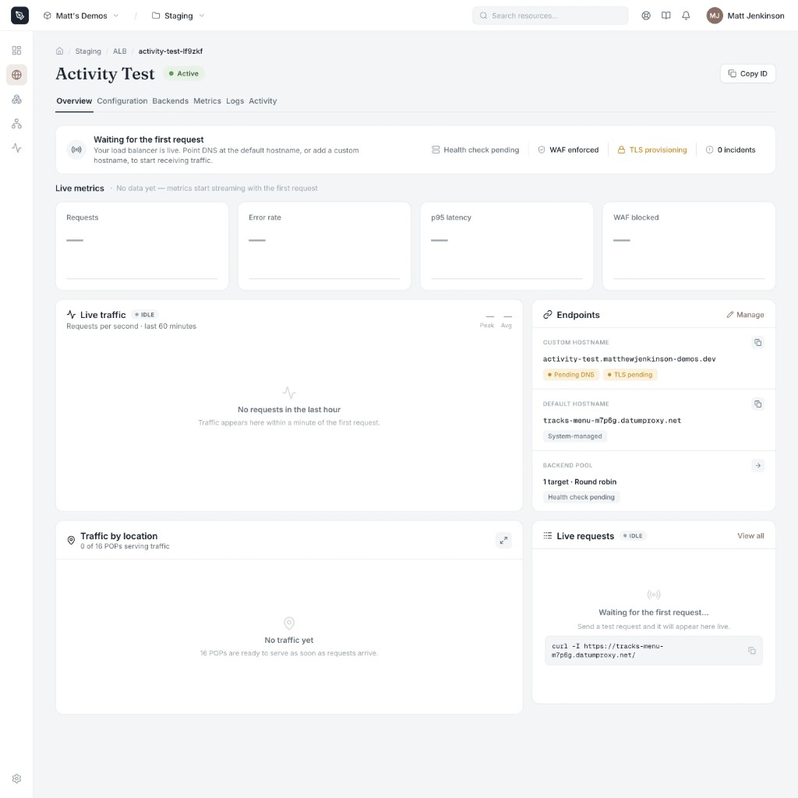
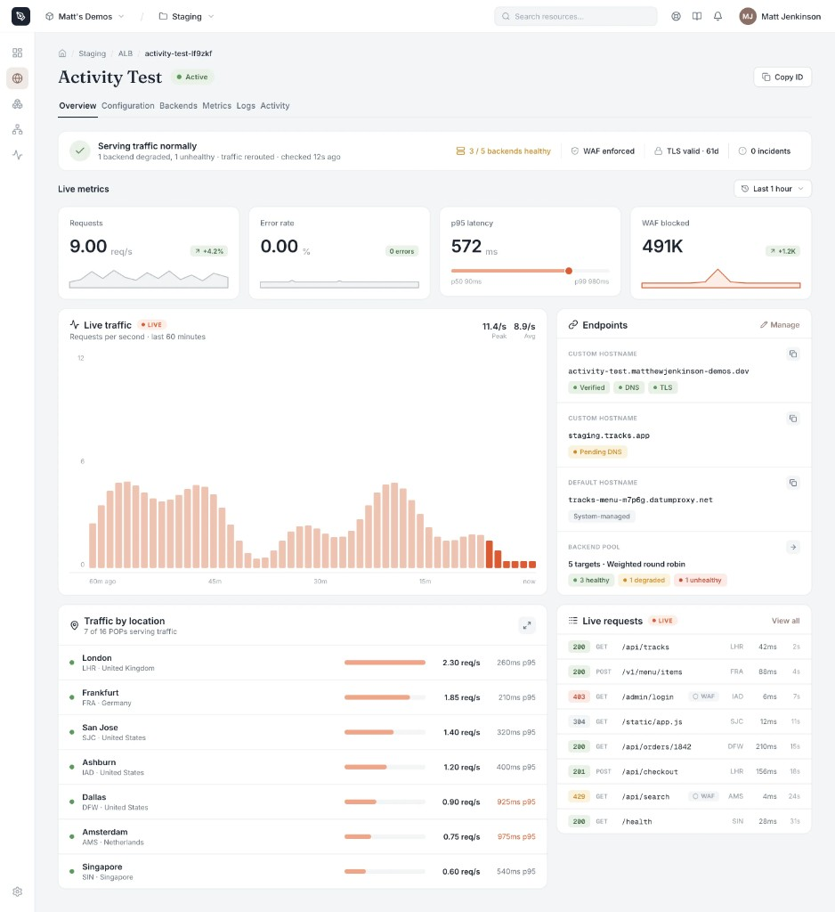
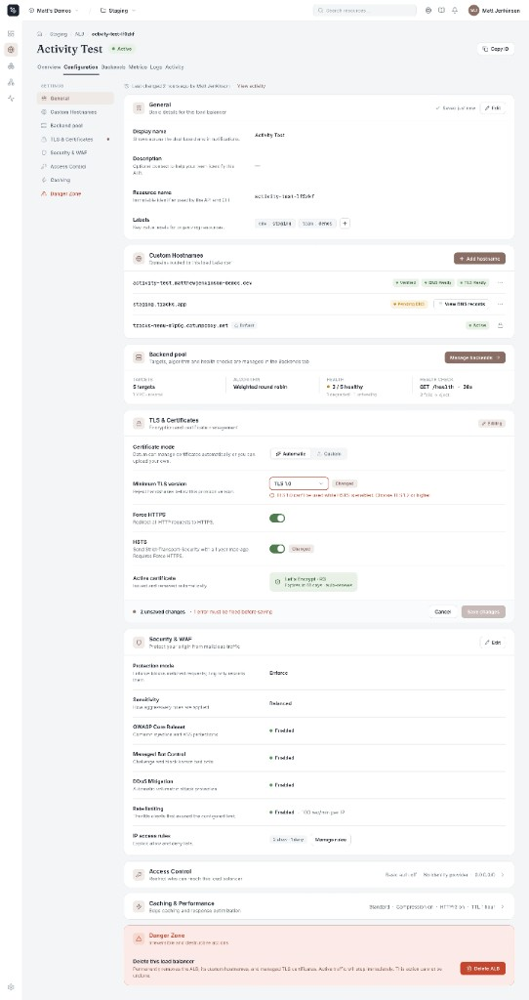

# Application Load Balancer portal UX

These mockups are the experience we want the cloud portal to ship for
Application Load Balancer. Treat this folder as the shared visual target.
Implementation lives in the portal, not in this operator.

The resource header, status, and tabs (Overview, Configuration, Backends,
Metrics, Logs, Activity) stay consistent across views. Overview is the default
landing page after create and from the resource list.

## Overview — waiting for the first request

The load balancer is live but has not seen traffic yet. The banner tells the
operator what to do next (point DNS or add a custom hostname). Metrics, the
traffic chart, location breakdown, and the request stream stay empty and
honest about that, instead of inventing zeros that look like a healthy idle
system. Endpoints still surface hostname and TLS status, and Live requests
offers a ready-to-copy `curl` against the default hostname so the first
request is one click away.

## Overview — serving traffic

Once requests arrive, Overview becomes the health and traffic surface. A
single banner answers whether the load balancer is serving normally, with
backend, WAF, TLS, and incident chips beside it. Live metric cards,
the last-hour request chart, and traffic by POP show volume and latency.
The sidebar keeps endpoints, backend-pool health, and a live request
stream in view so an operator can diagnose without leaving the page.

## Configuration

Configuration is a single scrolling page with jump-nav for General, Custom
Hostnames, Backend pool, TLS & Certificates, Security & WAF, Access Control,
Caching, and Danger Zone. Cards summarize the current state and open in
place to edit. Validation blocks save until errors are fixed (for example
an unsafe TLS minimum), and unsaved changes stay visible on the card.
Destructive actions stay isolated in the Danger Zone.

