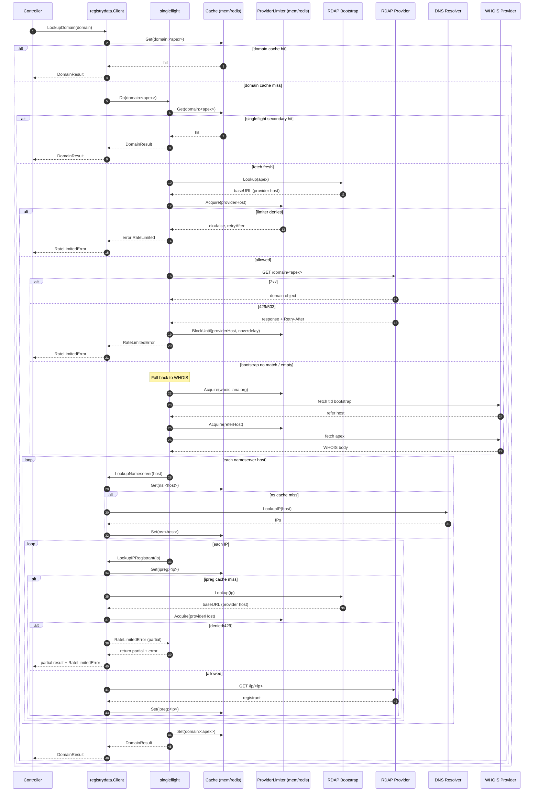
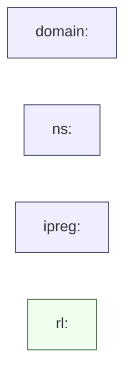

### `pkg/registrydata` design

This package provides a small client used by controllers to resolve registry-related data:

- **Domain registration** (RDAP preferred, WHOIS fallback)
- **Nameserver host → IPs** (DNS)
- **IP → registrant name** (RDAP IP)

It also provides **caching** and **per-upstream-host rate limiting/backoff** with optional Redis persistence.

### Key goals

- **Minimize upstream load** via caching and `singleflight`
- **Protect upstreams** via token-bucket limiting + explicit block windows (e.g. from `Retry-After`)
- **Return useful partial results** when a sub-step is rate limited

### Components

- **Client**: `NewClient(Config)` returns an implementation of `registrydata.Client`.
- **Cache** (`Cache` interface):
  - `memoryCache`: process-local
  - `redisCache`: shared across replicas (optional)
- **Limiter** (`ProviderLimiter` interface):
  - `memoryProviderLimiter`: process-local token bucket + blocked-until window
  - `redisProviderLimiter`: shared token bucket + blocked-until window (Lua scripts)

### Caching model

The client caches at multiple granularities (so partial progress can be reused):

- **Domain snapshot**: `domain:<apex>` → `DomainResult`
- **Nameserver**: `ns:<hostname>` → `nameserverCacheValue`
- **IP registrant**: `ipreg:<ip>` → `IPRegistrantResult`

Important behavior:

- The **domain snapshot** is cached only when `LookupDomain()` completes successfully.
- Nameserver/IP caches can still be populated even if a later step fails.

### Rate limiting model

Rate limiting is applied **per provider key**, which is a string:

- **RDAP**: provider key is the **RDAP base URL host** selected by bootstrap (e.g. `rdap.verisign.com`).
- **WHOIS**: provider key is the **WHOIS host** being queried (IANA bootstrap host and registry/registrar hosts).

The limiter supports:

- `Acquire(provider)`: token-bucket gate; returns `(ok=false, retryAfter=…)` when denied.
- `BlockUntil(provider, until)`: sets an explicit block window (used when RDAP returns 429/503 or `Retry-After`).

### Lookup behavior

- `LookupDomain(domain, opts)`:
  - normalizes input and computes **apex** (eTLD+1)
  - uses cache + `singleflight` to avoid stampedes
  - resolves **registration** via RDAP (fallback to WHOIS when bootstrap has no match)
  - determines which nameservers to use (apex vs delegated zone)
  - calls `LookupNameserver()` and then `LookupIPRegistrant()` for each IP
  - if an IP registrant lookup is rate limited, returns:
    - a **partial** `DomainResult`
    - a `*RateLimitedError` (so controllers can schedule a retry)

- `LookupNameserver(hostname, opts)`:
  - DNS lookup for A/AAAA
  - caches `ns:<hostname>`

- `LookupIPRegistrant(ip, opts)`:
  - RDAP IP query
  - caches `ipreg:<ip>`

### Controller interaction

Controllers typically:

- call `LookupDomain()`
- write whatever result is available into status
- if the error is `*RateLimitedError`, schedule a retry using `RetryAfter` (and optionally any `SuggestedDelay`)

This means that on the next reconcile:

- the **domain snapshot may not be cached** (if the prior call errored)
- but **nameserver/IP caches** may already be filled, so only the remaining missing sub-requests tend to hit upstreams

### Mermaid diagrams

#### End-to-end flow (happy path + rate-limit retry)

#### Cache key namespaces

